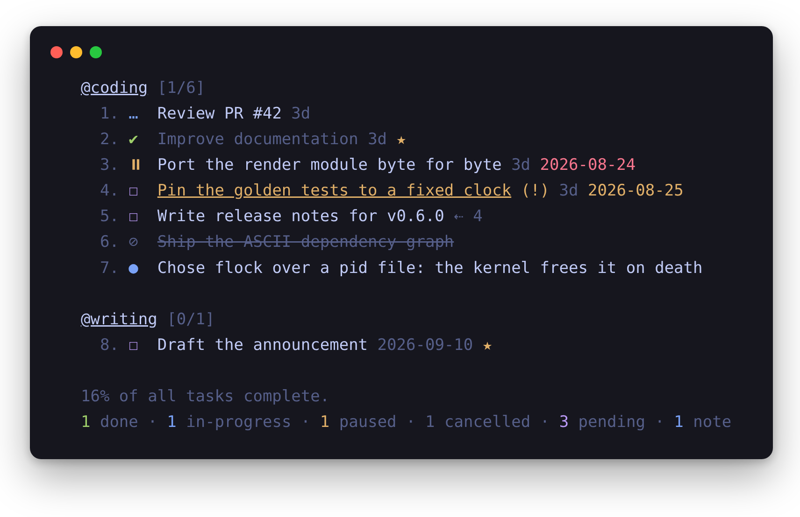
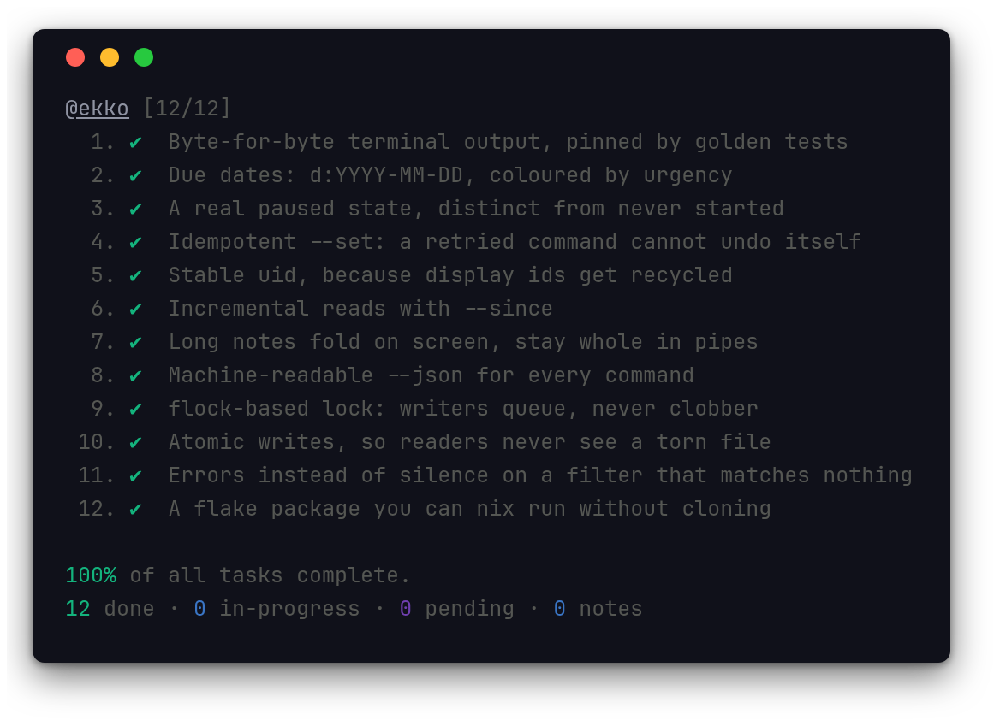
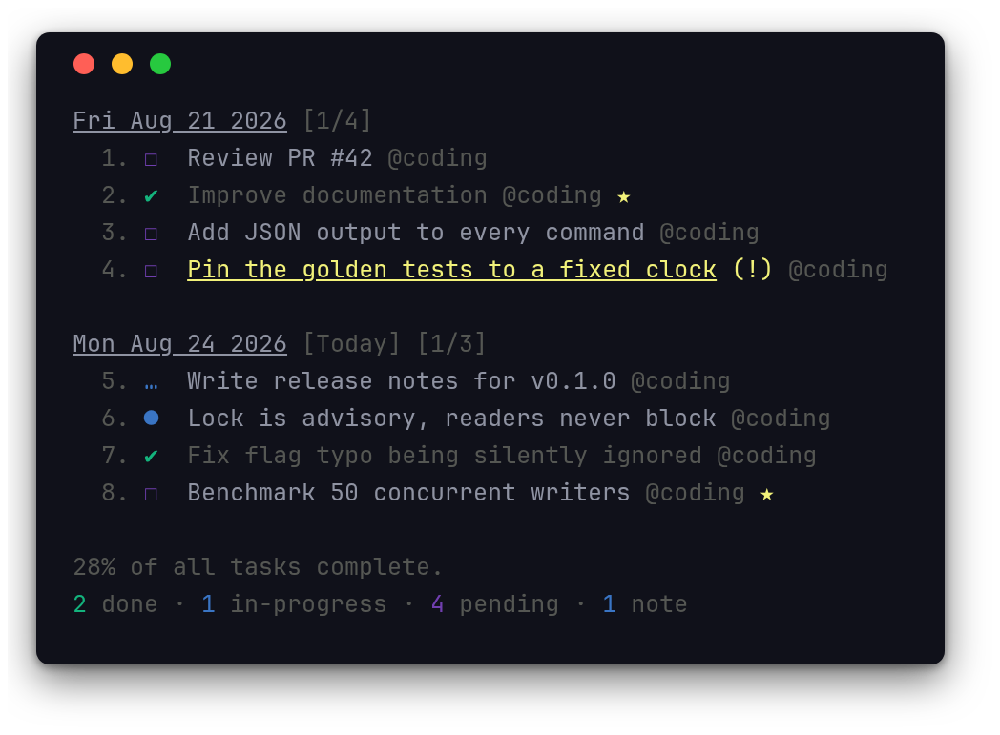
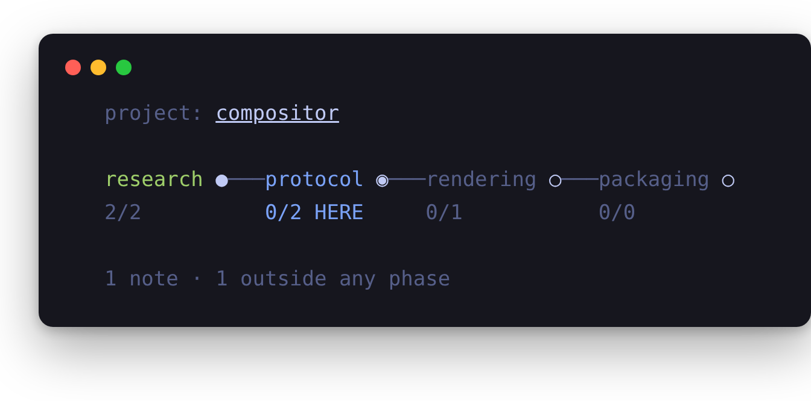

<h1 align="center">
  Ekko
</h1>

<h4 align="center">
  Tasks, boards & notes for the command-line habitat
</h4>

<div align="center">
  
</div>

## Description

Ekko is a pure-Rust rewrite of [taskbook](https://github.com/klaudiosinani/taskbook). It began as a faithful port -- the terminal output is still byte-for-byte identical for anything taskbook could produce, pinned by golden tests that diff against output captured from the real JavaScript build -- and everything underneath was rebuilt: machine-readable `--json` for every command, a `flock`-based cross-process lock so two invocations writing at once cannot silently clobber each other, and the JS test suite carried over and grown.

It has since grown past the original where the original was in the way. Due dates, a real paused state, retry-safe state changes, stable per-item ids and incremental reads are all Ekko's, and none of them disturb a board that does not use them. Where taskbook silently returned a plausible wrong answer, Ekko errors instead.

Effectively a task manager built to be driven by a human and an LLM/coding agent working the same boards at the same time, which is exactly the property the rewrite exists to make solid.

## Highlights

Inherited from taskbook, and rendered identically:

- Organize tasks & notes into boards
- Board & timeline views
- Priority & favorite mechanisms
- Search & filter items
- Archive & restore deleted items
- Progress overview
- Configurable through `~/.ekko.json`, data in plain JSON at `~/.ekko/storage`

Added by Ekko, each of them invisible until you use it:

- **Due dates** via `d:YYYY-MM-DD`, coloured by urgency and filterable with `--list due|overdue`
- **A real paused state**, so "set aside" stops looking like "never started"
- **A cancelled state**, struck through and kept, because deleting loses why the work was dropped
- **Projects**: one board per project via `--project`, with the filesystem as the registry
- **Phases and `--path`**: a project's journey, read backwards as history and forwards as a plan
- **Dependencies**: `--blocked-by`, and `--list ready` for what can actually be started
- **`--set`**, an idempotent alternative to the toggles: a retried command cannot undo itself
- **Stable `uid`s**, accepted anywhere a display id is, because display ids get recycled and `--restore` hands out new ones
- **`--since`**, reading only what changed rather than the whole board every time
- **Folded notes** on screen, whole in pipes and `--json`
- **Errors instead of silence** when a filter term matches nothing
- **A `flock` lock and atomic writes**, so concurrent invocations queue rather than lose updates
- **Stash and trash**: put finished work out of the way and keep it reachable, or remove it with 30 days to change your mind
- **`--ui`**, an interactive picker in the terminal, where a long note is one line in the list and whole in the preview
- **A reproducible `nix develop` shell**, and a flake package you can `nix run` without cloning

<div align="center">
  
</div>

## Contents

- [Description](#description)
- [Highlights](#highlights)
- [Install](#install)
- [Usage](#usage)
- [Views](#views)
- [Configuration](#configuration)
- [Flight Manual](#flight-manual)
- [Development](#development)
- [Credits](#credits)
- [License](#license)

## Install

With nix, nothing needs cloning:

```bash
$ nix run github:thiagoproldan/ekko -- --help
$ nix profile install github:thiagoproldan/ekko
```

The flake also exposes the `/ekko` Claude Code skill as `packages.skill`, so a home-manager config can install the tool and the skill it documents together, pinned to the same revision -- see [`skill/readme.md`](skill/readme.md).

With cargo, from a clone:

```bash
$ nix develop           # Rust toolchain: cargo, rustc, clippy, rustfmt
$ cargo install --path . --locked
```

That lands the binary in `~/.cargo/bin`, which your shell may not read. To build without installing: `cargo build --release`, and the binary appears at `target/release/ekko`.

Ekko is developed and tested on Linux. The parts that touch the OS are POSIX -- `flock(2)` for the storage lock, `ioctl(TIOCGWINSZ)` for the terminal width, `SIGPIPE` restored to its default -- but the clipboard backend behind `--copy` is built for Wayland, and nothing else is exercised by CI.

## Usage

```
$ ekko --help

  Usage
    $ ekko [<options> ...]

    Options
        none             Display board view
      --anchor <IDS>     Point a note at the task it explains
      --archive, -a      Display archived items
      --begin, -b        Start/pause task
      --blocked-by <IDS> Record what an item waits on
      --calendar         Show the current month
      --check, -c        Check/uncheck task
      --clear            Delete all checked items
      --copy, -y         Copy item description
      --create           Create the project named by --project
      --delete, -d       Delete item
      --destroy          Move the project named by --project to the trash
      --edit, -e         Edit item description
      --find, -f         Search for items
      --help, -h         Display help message
      --json, -j         Output machine-readable JSON instead of formatted text
      --list, -l         List items by attributes
      --move, -m         Move item between boards
      --note, -n         Create note
      --path             Show the project's journey through its phases
      --phase <NAME>     Scope work to one phase of a project
      --phases <NAME>... Declare the project's ordered phase sequence
      --priority, -p     Update priority of task
      --project <NAME>   Work against a named project instead of the default board
      --projects         List the projects that exist
      --restore, -r      Restore items from archive
      --set              Set item state idempotently (retry-safe)
      --since <MILLIS>   Only items changed at or after a timestamp
      --star, -s         Star/unstar item
      --stash [IDS]      Put items or a board away; no ids lists the stash
      --trash            Show the trash, and how long each thing has left
      --unstash <IDS>    Bring items back out of the stash
      --untrash <IDS>    Bring items back out of the trash
      --ekko-dir         Define a custom ekko directory
      --task, -t         Create task
      --timeline, -i     Display timeline view
      --ui               Interactive mode: a picker in the terminal
      --version, -v      Display installed version

    Examples
      $ ekko
      $ ekko --anchor @16 12
      $ ekko --archive
      $ ekko --begin 2 3
      $ ekko --calendar
      $ ekko --check 1 2
      $ ekko --clear
      $ ekko --copy 1 2 3
      $ ekko --delete 4
      $ ekko --edit @3 Merge PR #42
      $ ekko --find documentation
      $ ekko --project old --destroy
      $ ekko --json --task @coding Review PR #42
      $ ekko --list pending coding
      $ ekko --move @1 cooking
      $ ekko --note @coding Mergesort worse-case O(nlogn)
      $ ekko --priority @3 2
      $ ekko --restore 4
      $ ekko --star 2
      $ ekko --stash @due
      $ ekko --unstash 9
      $ ekko --task @coding @reviews Review PR #42
      $ ekko --task @coding Improve documentation
      $ ekko --task Make some buttercream
      $ ekko --timeline
      $ ekko --ui
```

## Views

### Board View

Invoking Ekko without any options will display all saved items grouped into their respective boards.

<div align="center">
  
</div>

### Timeline View

In order to display all items in a timeline view, based on their creation date, the `--timeline`/`-i` option can be used.

<div align="center">
  
</div>

### Interactive Mode

`ekko --ui` opens a picker in the terminal: the items on the left, whatever is selected in full on the right, and a prompt that filters as you type.

```
┌─────────────────────── Results ───────────────────────┐  ┌─────────────────────── Preview ────────────────────────┐
│    1. ✔ Vendor wlroots                                │  │                                                        │
│    2. … Damage tracking                               │  │ ● note                                                 │
│>     3. ● Damage is in surface coordinates, not output│  │                                                        │
│    4. ✔ Ship the package                              │  │ Damage is in surface coordinates, not output           │
│    5. ☐ Write the readme                              │  │ coordinates -- getting this backwards is why the first  │
│                                                       │  │ attempt flickered, and it cost most of an afternoon to  │
│                                                       │  │ find                                                   │
└───────────────────────────────────────────────────────┘  │ boards   @wayland                                      │
┌─────────────────────── Prompt ────────────────────────┐  │ explains a task                                        │
│ >                                               5 / 5 │  │ created  Fri Aug 28 2026                               │
└───────────────────────────────────────────────────────┘  └────────────────────────────────────────────────────────┘
```

Type to filter, arrows or `Ctrl-n`/`Ctrl-p` to move, `Enter` to complete a task, `Tab` to start or pause one, click to select, `Esc` to leave.

The split is the point rather than decoration. Notes hold the reasoning worth keeping, which is exactly why they run long -- on a real board they took 43 of 85 item lines. [Folding](#folded-notes) copes with that by truncating to fit one line; a picker does not have to truncate anything, because the list holds one line per item and the whole text lives in the preview, on demand. The long note stays long and stops being a wall.

Three things about how it behaves, each of them a consequence of the board being shared:

- **It never holds the lock while idle.** A write takes the lock and releases it immediately, the same as any other command. A UI parked on the `flock` would block your other terminal and every agent -- the exact failure the lock exists to prevent, caused by the thing meant to help.
- **It reloads after every write**, so the screen reports what landed rather than what was asked for. That costs under 10ms on a real board.
- **It changes nothing about the CLI.** Interactive mode is a separate frontend on the same core and never goes through the renderer the golden tests pin, so the byte-for-byte guarantee is untouched by construction rather than by care.

### Calendar

`ekko --calendar` draws the current month, with today picked out.

```
$ ekko --calendar

      August 2026
  Su Mo Tu We Th Fr Sa
                     1
   2  3  4  5  6  7  8
   9 10 11 12 13 14 15
  16 17 18 19 20 21 22
  23 24 25 26 27 28 29
  30 31
```

**Nothing from the board is on it yet, on purpose.** Drawing a month and deciding what a day should show are two separate questions, and the second one is genuinely open: a day could mean what is *due* then, or what was *created* then. Those are different views -- the first looks forward and would be the only forward-looking thing Ekko has, the second looks back and would overlap [`--timeline`](#timeline-view), which already groups by creation date and renders in a similar shape.

Weeks start on Sunday, matching `cal(1)`. The month is derived from the dates themselves rather than a table of lengths, so February in a leap year comes out right without the calendar being able to disagree with the calendar.

### Path View

Inside a project with declared phases, `--path` shows the journey through them: filled for what is behind, marked for the phase holding work now, hollow for what is still ahead. The same picture reads backwards as history and forwards as a plan.

<div align="center">
  
</div>

Anything created in the project without `--phase` sits at the project root, outside the path, and is counted at the foot rather than guessed into a phase. See [Phases and the path](#phases-and-the-path).

## Configuration

To configure Ekko navigate to the `~/.ekko.json` file and modify any of the options to match your own preference. To reset back to the default values, simply delete the config file from your home directory.

The following illustrates all the available options with their respective default values.

```json
{
  "ekkoDirectory": "~",
  "displayCompleteTasks": true,
  "displayProgressOverview": true
}
```

### In Detail

##### `ekkoDirectory`

- Type: `String`
- Default: `~`

Filesystem path where the storage will be initialized, i.e: `/home/username/the-cloud` or `~/the-cloud`

If left undefined the home directory `~` will be used and Ekko will be set up under `~/.ekko/`.

##### `displayCompleteTasks`

- Type: `Boolean`
- Default: `true`

Display tasks that are marked as complete.

##### `displayProgressOverview`

- Type: `Boolean`
- Default: `true`

Display progress overview below the timeline and board views.

## Flight Manual

The following is a minor walkthrough containing a set of examples on how to use Ekko.

### Create Task

To create a new task use the `--task`/`-t` option with your task's description following right after.

```
$ ekko -t Improve documentation
```

### Create Note

To create a new note use the `--note`/`-n` option with your note's body following right after.

```
$ ekko -n Mergesort worse-case O(nlogn)
```

### Create Board

Boards are automatically initialized when creating a new task or note. To create one or more boards, include their names, prefixed by the `@` symbol, in the description of the about-to-be created item. As a result the newly created item will belong to all of the given boards. By default, items that do not contain any board names in their description are automatically added to the general purpose; `My Board`.

```
$ ekko -t @coding @docs Update contributing guidelines
```

### Check Task

To mark a task as complete/incomplete, use the `--check`/`-c` option followed by the ids of the target tasks. Note that the option will update to its opposite the `complete` status of the given tasks, thus checking a complete task will render it as pending and a pending task as complete. Duplicate ids are automatically filtered out.

```
$ ekko -c 1 3
```

### Begin Task

To mark a task as started/paused, use the `--begin`/`-b` option followed by the ids of the target tasks. The functionality of this option is the same as the one of the above described `--check` option.

```
$ ekko -b 2 3
```

### Star Item

To mark one or more items as favorite, use the `--star`/`-s` option followed by the ids of the target items. The functionality of this option is the same as the one of the above described `--check` option.

```
$ ekko -s 1 2 3
```

### Copy Item Description

To copy to your system's clipboard the description of one or more items, use the `--copy`/`-y` option followed by the ids of the target items. Note that the option will also include the newline character as a separator to each pair of adjacent copied descriptions, thus resulting in a clear and readable stack of sentences on paste.

```
$ ekko -y 1 2 3
```

On Linux, copying spawns a short-lived detached process to keep serving the clipboard after `ekko` itself exits (X11/Wayland make the copying application responsible for answering paste requests; a process that exits immediately can't). It goes away once something else claims the clipboard.

### Display Boards

Invoking Ekko without any options will display all of saved items grouped into their respective boards.

```
$ ekko
```

### Display Timeline

In order to display all items in a timeline view, based on their creation date, the `--timeline`/`-i` option can be used.

```
$ ekko -i
```

### Set Priority

To set a priority level for a task while initializing it, include the `p:x` syntax in the task's description, where x can be an integer of value `1`, `2` or `3`. Note that all tasks by default are created with a normal priority - `1`.

- `1` - Normal priority
- `2` - Medium priority
- `3` - High priority

```
$ ekko -t @coding Fix issue `#42` p:3
```

To update the priority level of a specific task after its creation, use the `--priority`/`-p` option along with the id the target task, prefixed by the `@` symbol, and an integer of value `1`, `2` or `3`. Note that the order in which the target id and priority level are placed is not significant.

```
$ ekko -p @1 2
```

### Due Dates

To give a task a deadline while creating it, include a `d:YYYY-MM-DD` token in the description, alongside `p:x` if you want both. The token is stripped from the description, and a date that does not parse is an error (`INVALID_DUE_DATE`) rather than a task quietly created without one.

```
 -t @coding Ship the release notes d:2026-09-01 p:2
```

Due dates show up next to the item, coloured by where they stand: red once past, yellow on the day itself, grey while still ahead, and grey again once the task is checked off -- a finished task is not late. Notes take no deadline, the same way they take no priority.

Filter with `--list due` for everything carrying a deadline, or `--list overdue` for open tasks whose date has passed. Both compose with board names, so `ekko -l overdue coding` narrows to one board.

This is an Ekko addition; taskbook has no equivalent. Items without a due date are unaffected, on screen and in `storage.json` alike -- the field is omitted entirely when unset, so files stay readable by taskbook.


### Anchored Notes

A note explains something. Until now it explained it from beside the work rather than under it, so a long reason about item 2 had two homes and both were bad: crammed into 2's own description, or floating nearby with nothing connecting them.

`--anchor` points a note at the task it is about. The note then renders under that task, indented:

```
$ ekko --anchor @3 2
 ✔  Note 3 now explains: 2

$ ekko
  @wayland [0/3]
    1. ☐  Vendor wlroots
    2. ☐  Damage tracking
      3. ●  Damage is in surface coordinates, not output coordinates
    4. ☐  Ship the package
    5. ●  a note about nothing in particular
```

Passing no target clears it: `ekko --anchor @3`.

Four rules, each one narrowing the feature on purpose:

- **Only a note can be anchored.** A task under a task is a subtask, which raises real questions about whose total it counts toward, and answering them by accident is worse than not having it.
- **Only to a task.** A note under a note would allow chains, and chains allow cycles. One level, always, and cycles impossible by shape rather than by a check somebody has to remember.
- **Stored by `uid`.** Ids are recycled, and a reason pointing at a recycled number would end up explaining different work.
- **A note whose task lives on another board stays where it is.** It renders unnested rather than jumping boards -- surprising placement is worse than an un-nested reason, and the note is still where it was filed.

The `[complete/tasks]` counter never counted notes and still does not. What changes is that anchored notes stop competing for sibling lines, so the list you scan is the work.

### Folded Notes

Notes hold the reasoning worth keeping, which is why they run long. On a real board they took 56 of 94 rendered lines while every task, open and closed, took 28 -- so a board becomes unscannable through its notes, not its tick marks.

When stdout is a terminal, a note too long for one line is shortened and told on itself:

```
   28. ●  Timeline idea, with the constraints that survived scrutiny. (1) A node is … (+12 lines)
```

The count is useful on its own: you can see which notes are dense before deciding to open one.

Three deliberate limits:

- **Only when stdout is a terminal.** `ekko | grep` and `ekko > file` get every note in full, so nothing that reads Ekko's output breaks. Folding asks the terminal for its width directly rather than reusing the colour decision, because `FORCE_COLOR=1 ekko > file` must still write everything.
- **Only notes.** A truncated task hides something you are meant to act on; a truncated note hides something you can go and read.
- **Only when it helps.** Below about two dozen usable columns the marker would eat most of the line, so the note is left whole for the terminal to wrap.

To read a folded note in full, pipe the output (`ekko | less`) or use `--json`, which never folds.

### Dependencies

Record what an item waits on, and the board stops pretending everything is equally startable:

```
$ ekko --blocked-by @3 1 2
 ✔  Item 3 now waits on: 1, 2
```

```
  @packaging [0/3]
    1. ☐  Vendor wlroots
    2. ☐  Damage tracking
    3. ☐  Ship the package ⇠ 1, 2
```

`--list ready` is the daily question -- what can be started right now -- and `--list blocked` is its complement.

Four properties, each of them a consequence rather than a feature:

- **Blockers are evaluated live, never latched.** Finishing a blocker unblocks whatever waited on it, with nothing to do by hand; the marker only ever names what is holding the item up *now*. Reopening a finished blocker blocks it again, which is what makes going back to an earlier link work at all.
- **A blocker that is cancelled or deleted stops blocking.** Neither can ever be finished, so treating them as outstanding would strand the waiter forever.
- **Stored by `uid`, not by display id.** Ids are recycled, and a dependency stored as a number would quietly follow the number to a different item.
- **Cycles are refused.** Two items waiting on each other is a pair nothing can make ready, and the board would state it as calmly as any other fact.

`--blocked-by` replaces the list rather than adding to it, the same contract `--move` and `--phases` already use. Passing it with no blockers clears them:

```
$ ekko --blocked-by @3
 ✔  Item 3 waits on nothing
```

That matters more than it looks. A dependency you cannot undo does not stay a mistake quietly — it becomes a false statement the board carries as if it were data, and only a person reading the description will ever notice.

There is no picture yet, on purpose. The data is what a drawing would need anyway, and whether a drawing earns its keep is easier to answer after living with `--list ready` for a while than before.

### Phases and the path

Inside a project the shape is `project > phase > area`. The default board has no phases at all -- it stays what it always was, areas and tasks, for when you just want to write something down.

Declare the sequence, then work inside it:

```
$ ekko --project winwayland --phases setup compositor packaging
$ ekko --project winwayland --phase compositor --task @render Damage tracking
$ ekko --project winwayland --path
```

```
  project: winwayland

  setup ●───compositor ◉───packaging ○
  2/2       0/2 HERE       0/1

  1 note · 1 outside any phase
```

Filled is behind you, `◉ HERE` is where work sits, hollow is still ahead -- so the same picture reads backwards as history and forwards as a plan. A phase nobody has started yet is a legitimate thing to have: that is where speculation lives.

Five decisions worth knowing:

- **Each phase is its own world.** `@render` under `setup` and `@render` under `compositor` are two areas, not one appearing twice. Scoping is what tells them apart.
- **`--phases` replaces the sequence.** Inserting a phase in the middle is the common case and appending cannot express it, so the whole list is given at once -- the same contract `--move` already has for an item's boards.
- **Order cannot be derived.** "Setup comes before build" is knowledge, not a timestamp. It is the only thing in Ekko you have to state outright.
- **No phase means the project root.** An item created without `--phase` is never filed into a guessed current phase; it sits outside the path, and the path says how many are out there.
- **`--path` is invoked, never automatic.** The board view is unchanged whether phases exist or not.

Cancelled tasks leave a phase's total, the same way they leave the percentage, so a phase that drops work can still read as finished.

### Projects

One board per project, without typing paths. `--project <name>` works against `~/.ekko/projects/<name>` instead of the default board:

```
$ ekko --project winwayland --create      # first time only
$ ekko --project winwayland --task @setup Build the compositor

$ ekko --projects
  compositor [3/12] · 2 notes
  winwayland [0/0]
```

`EKKO_PROJECT` does the same for a whole shell, the way `EKKO_DIR` already does for a directory.

This is sugar over `--ekko-dir`, which could always point at a per-project board -- what it adds is not having to remember where each one lives. Four decisions worth knowing:

- **The filesystem is the registry.** There is no list of projects kept alongside the directories, so nothing can drift out of step with what exists. `--projects` reads the directory.
- **The listing says what each project holds**, in the same `[complete/tasks]` a board title uses, with notes counted separately and shown only when there are any. Its size should be visible before you act on it, not after.
- **An unknown name is an error**, and the message carries the fix. Creating on first use would turn a typo into a new, empty project -- the same failure as a filter that silently matches nothing.
- **The active project is printed above the board.** `EKKO_PROJECT` set and forgotten would otherwise show a different board with nothing on screen saying so.
- **The default board is untouched.** Projects are additional; a setup that never uses one behaves exactly as before.

#### Destroying a project

```
$ ekko --project old --destroy
 ✔  Destroyed project: old (15 tasks · 4 notes)
  moved to /home/you/.ekko/.trash/old-1787708896450
```

The word is `--destroy` and not `--delete` because `--delete` already means "remove items": `--project old --delete 3` removes item 3 *inside* `old`. One word with both meanings would turn a command that lost its ids into one that destroyed the whole project, and the failure would look like success.

Four things it does, each answering something the `rm -rf` it replaces got wrong:

- **It takes the project's lock first**, so a concurrent write finishes instead of having its directory pulled out from under it. `flock` protects writers from each other; it never protected anything from the directory vanishing, because whoever ran `rm -rf` did not go through Ekko.
- **It counts before it moves**, because afterwards nothing could say how big the thing was.
- **It moves rather than deletes.** Every other removal in Ekko has somewhere to come back from; this one had nothing. Destroyed projects go to `~/.ekko/.trash/<name>-<epoch-millis>`, which sits *beside* `projects/` rather than inside it -- inside would make every destroyed project show up in `--projects` until a filter hid it, and that filter would reserve `.trash` as a name nobody could give a project. The timestamp is what lets destroy, recreate and destroy again keep both copies. Nothing empties the trash for you; `mv` a directory back into `~/.ekko/projects/` to restore it.
- **It does not ask.** No command in Ekko prompts, and one that did would break every script and agent driving it. The count in the reply is the confirmation, and the trash is the safety net.

One race is left on purpose: a second process already blocked on the lock will acquire it *after* the move and write into the trashed copy rather than a live project. Nothing is lost -- the writes land somewhere no longer listed. Closing it would need a tombstone protocol for the case of two processes racing on one project at the moment it is destroyed.

`--project` and `--ekko-dir` together is an error rather than one silently winning: both say where data lives, and guessing which was meant is how you write to the wrong board.

### Cancelling

Some work gets dropped without being finished, and deleting it loses the part worth keeping: why it was dropped. A cancelled task stays on the board, struck through and greyed out.

```
    1. ☐  never started
    2. …  in progress
    3. ⏸  paused
    4. ✔  done
    5. ⊘  Migrate to the new API
```

`ekko --set @5 cancelled` drops a task; `--set @5 unstarted` revives it, as does any other state -- cancelling is terminal but not permanent. Aliases: `cancel`, `canceled`.

Three consequences worth knowing, each of them deliberate:

- **It is not pending.** `--list pending` excludes cancelled tasks, because a dropped task is not waiting to be done. `--list cancelled` finds them.
- **It is not counted in the percentage.** Cancelled work is not work, so a board that drops something can still reach 100%. It still appears in the stats line, so nothing is hidden.
- **Priority markers are dropped with it.** A struck-through line still shouting `(!!)` reads as a contradiction.

The task keeps its description, so the record of what was dropped survives. If *why* matters, put it in the description (`--edit`) or leave a note beside it -- Ekko does not ask for a reason, and a field nobody fills in would be worse than the habit.

### Pausing

`--check`, `--begin` and `--star` toggle; setting a task back out of progress with any of them leaves it looking exactly like a task that was never started. Those are different situations, and conflating them is how a board comes to report `0 pending` while two tasks sit half-done.

A paused task keeps its own state and its own icon:

```
    1. ☐  never started
    2. …  in progress
    3. ⏸  paused
    4. ✔  done
```

`ekko --set @3 paused` sets a task aside; `--set @3 progress` resumes it; `--set @3 unstarted` clears both flags and returns it to never-started, which is also how to undo a `--set progress` aimed at the wrong id. Finishing a task settles it either way.

Nothing is paused automatically. Ekko instead points out when more than one task is in progress, since that is the state where the marker stops telling you where you are:

```
2 tasks in progress -- pause the ones you are not on: ekko --set @id paused
```

Both additions are conditional: the `paused` count joins the stats line only when it is above zero, and the warning only appears when it applies. A board that keeps to one task at a time prints exactly what it printed before.

This is an Ekko addition, though the concept is not: taskbook's own help calls `--begin` "Start/pause task". It named pausing without giving it anywhere to live.

### Stable ids

The next display id is `max + 1`, so deleting the highest-numbered item and creating another hands that number straight back out. For someone typing at a terminal that is fine -- the id you use is the one on screen in front of you. For anything holding a reference between one command and the next, it is a trap.

Every item therefore carries a `uid` in `--json`: never recycled, and unchanged when an item is archived and restored. It is accepted **anywhere a display id is** -- `--set`, `--edit`, `--move`, `--priority`, `--delete`, `--blocked-by`, `--restore`, and the toggles.

```
$ ekko --set @18cfa4987d5ce3-1043bc done    # `@` marks the id, as always
$ ekko --star 18cfa4987d5ce3-1043bc         # toggles take it bare
```

The two spellings cannot be confused: a uid is `{nanos:x}-{pid:x}`, so it always carries a hyphen and never parses as a number. Both miss the same way, as `INVALID_ID`, because a caller branching on the error code should not have to care which it used.

This shipped incomplete and real use found it: the `uid` existed and no command accepted one, so the advice to carry it across turns could not actually be followed. A caller could hold the stable reference and then had nothing to do but re-read the board to translate it back into a number that might have moved.

### Incremental Reads

Reading the whole board to find out what changed gets expensive fast, and for a script or an agent syncing on every step it is nearly all waste. `--since` takes an epoch-millisecond timestamp and returns only items changed at or after it, grouped by board exactly like the default view.

```
$ ekko --json --since 1787600000000
```

Every item carries `updatedAt`, stamped whenever it actually changes -- distinct from `_timestamp`, which is creation time and never moves. The sync loop is therefore: read with `--since <last>`, do the work, and remember the highest `updatedAt` you saw as the next `<last>`.

On a forty-item board, syncing one changed item this way costs around 330 bytes against roughly 11.5 KB for the full board.

Two limits worth knowing. A write that changes nothing does not bump `updatedAt`, so an idempotent `--set` that was already satisfied will not resurface. And deletions leave nothing behind to carry a timestamp: a caller that must notice removals has to compare id sets, not just read `--since`. Items predating the field fall back to their creation time rather than disappearing, so `--since 0` still returns everything.

### Setting State Idempotently

`--check`, `--begin` and `--star` all **toggle**, which is right at a terminal and wrong for anything that might retry: run `ekko -c 3` twice after a timed-out first attempt and the task ends up unchecked again.

`--set` takes the states an item should end up *in*, so running it twice does the same thing as running it once. Ids are marked with `@`, exactly as in `--priority` and `--move`, which leaves bare words free to name states.

```
$ ekko --set @3 done
$ ekko --set @1 @2 progress starred
```

Accepted states, with their aliases: `done`/`checked`/`complete`, `undone`/`unchecked`/`incomplete`/`pending`, `progress`/`started`/`begun`, `paused`, `cancelled`/`cancel`/`canceled`, `unstarted`/`unstart`, `starred`/`star`, `unstarred`/`unstar`. They are the same words `--list` filters on, so there is one vocabulary rather than two. An unrecognised state is an error (`UNKNOWN_STATE`), not a silent no-op.

Task-only states are ignored on notes, matching how `--check` already ignores them; starring applies to both.

This is an Ekko addition. The toggles are unchanged and remain the shorter thing to type by hand.

### Move Item

To move an item to one or more boards, use the `--move`/`-m` option, followed by the target item id, prefixed by the `@` symbol, and the name of the destination boards. The default `My board` can be accessed through the `myboard` keyword. The order in which the target id and board names are placed is not significant. Note that this **replaces** the item's board list; it does not add to it -- list every board you want the item to keep, not just the new one.

```
$ ekko -m @1 myboard reviews
```

### Stash and Trash

Two ways for something to leave the board without leaving Ekko, and they differ in why it went.

**Stash** is for putting something away. Work that is finished, or was cancelled, and that you still want within reach -- the reasoning beside a closed-out area, the decision you might need to reread. It stays in storage, keeps its id, and simply stops being shown.

```
$ ekko --stash @due
 ✔  Stashed items: 1, 2, 3

$ ekko
  @work [0/1]
    4. ☐  something still open

  0% of all tasks complete.
  0 done · 0 in-progress · 1 pending · 0 notes · 3 in-stash

$ ekko --stash
  @due (stashed today)
    1. ✔  Store dueDate on Item
    2. ✔  Render overdue items in red
    3. ●  Chose Option<String> over a date type
```

A note stashed with the tasks it explains comes back beside them: the stash is grouped by the board things came from, so putting a finished area out of the way does not shred it on the way out. `--unstash <ids>` brings anything back, **as what it was** -- a stashed done task is still done underneath, which is why this is its own field rather than another state.

`@board` stashes what is on that board *now*. It does not close the board: something created there tomorrow shows up normally.

**Trash** is for removal, and it expires.

```
$ ekko --delete 4
 ✔  Trashed item: 4

$ ekko --trash
  Trash
    4. ☐  something still open  expires in 30d
```

The countdown is not decoration. Without it "expires" is a promise nobody can see coming, and the first time anyone learns the trash empties is when they go looking for something that is gone. It turns red in the last week, the same urgency vocabulary due dates already use.

Ekko has no daemon, so the trash empties on the way past a **write** -- never on a read. A command that only looks at the board must not change it, which is the same rule `--projects` follows when it counts without creating anything.

Three things worth knowing about how the counts behave:

- **`in-stash` and `in-trash` are counted instead of what the item was, not as well.** A stashed done task appears under `in-stash` and not under `done`, so the line still sums to the board and answers what is in front of you rather than what exists.
- **The percentage can go down when you stash finished work.** That is the same reasoning that keeps cancelled out of the denominator: it reports what is on the board now.
- **`--clear` does not reach into the stash.** Something put away on purpose is not on the board, and sweeping it into the archive would undo the stash and change its id on the way back.

### Delete Item

To delete one or more items, use the `--delete`/`-d` options followed by the ids of the target items. Duplicate ids are automatically filtered out.

```
$ ekko -d 1 2
 ✔  Trashed items: 1, 2
```

Deleted items go to [the trash](#stash-and-trash), not the archive. The archive is the record of what got done; a task deleted by mistake sitting in it is noise in the one history worth trusting. The trash keeps them for 30 days and `--untrash` brings them back.

A trashed item **keeps its id** for as long as it is in there, so `--untrash 5` can only mean one thing. That is a change from before: `--delete` used to free the number immediately. `--clear` still does, because archiving really does remove the item.

### Delete Checked Tasks

To delete/clear all complete tasks at once across all boards, use the `--clear` option. Note that all deleted tasks are automatically archived, and can be inspected or restored at any moment. In order to discourage any possible accidental usage, the `--clear` option has no available shorter alias.

```
$ ekko --clear
```

### Display Archive

To display all archived items, use the `--archive`/`-a` option. Note that all archived items are displayed in timeline view, based on their creation date.

```
$ ekko -a
```

### Restore Items

To restore one or more items, use the `--restore`/`-r` option followed by the ids of the target items. Note that the ids of all archived items can be seen when invoking the `--archive`/`-a` option, **and are a separate id space from storage** -- a restored item gets a new id in `storage.json`, it does not get its old one back. `--delete`'s `--json` response reports both, precisely so a script/agent driving `--restore` afterward never has to guess.

```
$ ekko -r 1 2
```

### List Items

To list a group of items where each item complies with a specific set of attributes, use the `--list`/`-l` option followed by the desired attributes. Board names along with item traits can be considered valid listing attributes. For example to list all items that belong to the default `myboard` and are pending tasks, the following could be used;

```
$ ekko -l myboard pending
```

The by default supported listing attributes, together with their respective aliases, are the following;

- `myboard` - Items that belong to `My board`
- `task`, `tasks`, `todo` - Items that are tasks.
- `note`, `notes` - Items that are notes.
- `pending`, `unchecked`, `incomplete` - Items that are pending tasks (note: an in-progress task is not yet complete either, so it matches this too).
- `progress`, `started`, `begun` - Items that are in-progress tasks.
- `done`, `checked`, `complete` - Items that complete tasks.
- `star`, `starred` - Items that are starred.
- `due` - Tasks that have a due date.
- `overdue` - Tasks whose due date has passed and that are not yet complete.
- `cancelled`, `canceled` - Tasks that were dropped rather than finished.
- `ready` - Open tasks with nothing outstanding blocking them.
- `blocked` - Items still waiting on something.

A board can be named either bare or in the `@name` form the board view prints, so `--list release` and `--list @release` are equivalent. A term matching neither a board nor an attribute above is an error (`UNKNOWN_LIST_TERM`), not a silent no-op.

Both are deliberate departures from taskbook, which accepted the bare form only and listed *every* board when a term matched nothing -- indistinguishable, from the output alone, from a filter that legitimately matched everything. That is a bad answer for a person and a worse one for a script or an agent, which cannot tell the two apart at all.

### Search Items

To search for one of more items, use the `--find`/`-f` option, followed by your search terms.

```
$ ekko -f documentation
```

### Runtime ekko directory override

To override the configured storage location, use the `--ekko-dir` flag or `EKKO_DIR` environment variable. While Ekko is designed to provide a multiple board approach for all of your projects, these options enable alternative use cases. Setup per-project storage or run multiple global boards like home and work.

Note, if both the flag and environment variable are present Ekko will use the flag value.

```
$ ekko --ekko-dir .custom-ekko-dir
```

```
$ EKKO_DIR=~/hometasks ekko
```

### Locating the data files

All task/note data lives in one JSON file, written atomically (temp file + rename) so it is always safe to read directly, without going through the CLI: `<ekko-dir>/storage/storage.json`. Deleted/archived items live alongside it at `<ekko-dir>/archive/archive.json`. `<ekko-dir>` defaults to `~/.ekko` and follows the same resolution order as the `--ekko-dir` flag described above.

```
$ cat ~/.ekko/storage/storage.json
```

Every command that writes (`--task`, `--check`, `--delete`, ...) takes a lock at `<ekko-dir>/.lock` for its duration, so two `ekko` processes -- two terminals, two scripts, two agents -- touching the same directory at once queue up instead of silently clobbering each other's write. A second process waits up to 5 seconds before reporting `LOCK_TIMEOUT`.

The lock is `flock(2)`, which means there is no such thing as a stale one: the kernel drops it when the holding process exits, however it exits. Nothing has to notice a dead holder, and nothing ever steals a lock from a live one. An earlier port of taskbook's pid-file scheme did try to tell the two apart, and the gap between checking and acting silently lost writes; `tests/concurrency.rs` spawns real processes and kills them mid-hold to keep that fixed. You never need to touch the file by hand.

### Machine-readable output

Add the `--json`/`-j` flag to any command to get a single-line JSON object on stdout instead of formatted text -- meant for scripts and agents that need to parse the result, rather than scrape colored terminal output. It composes with every other flag.

```
$ ekko --json --task @coding Review PR #42
{"ok":true,"command":"task","item":{"_id":7,"_date":"Mon Aug 24 2026","_timestamp":1787532527693,"description":"Review PR #42","isStarred":false,"boards":["@coding"],"_isTask":true,"isComplete":false,"inProgress":false,"priority":1}}
```

On success, the object always has `ok: true` and a `command` field naming what ran, plus whatever data that command produces (a `create`d/`edit`ed/`move`d/`priority`-updated item's full record, id lists for `check`/`begin`/`star`, board- or date-grouped items for the view commands, etc). On failure it's `ok: false` with an `error` message and a stable `code` (`MISSING_ID`, `INVALID_ID`, `MISSING_DESC`, `INVALID_IDS_NUMBER`, `INVALID_PRIORITY`, `MISSING_BOARDS`, `UNKNOWN_LIST_TERM`, `INVALID_DUE_DATE`, `MISSING_STATE`, `UNKNOWN_STATE`, `INVALID_CUSTOM_APP_DIR`, `MISSING_EKKO_DIR_FLAG_VALUE`, `LOCK_TIMEOUT`) to branch on instead of matching on the message text -- the process also exits `1`, same as without `--json`.

A couple of things worth knowing:

- **`--json` always returns complete data.** The `displayCompleteTasks`/`displayProgressOverview` preferences in `~/.ekko.json` only affect the human-readable views; JSON output never hides anything.

Every item created by Ekko also carries a `uid`: a stable identifier that, unlike `_id`, is never recycled and survives `--restore`. Ids are assigned as `max + 1`, so deleting the highest-numbered item and creating another hands the new one the same number -- which makes `_id` a poor thing to hold on to across time. Scripts and agents that keep a reference between invocations should key on `uid`.

Items written before uids existed, and any written by taskbook, have no `uid` field. Ekko does not backfill one, because that would rewrite files it otherwise leaves untouched; an absent `uid` means "legacy", not "unknown".

- **Output is [newline-delimited JSON](https://github.com/ndjson/ndjson-spec), not always a single object.** A few commands (the default board view, `--timeline`, `--list`) print a data line followed by a separate `{"command":"stats",...}` line. Parse stdout line by line, not as one JSON document.
- If you drive `ekko` through `nix develop --command`, the devShell's own banner goes to stderr, not stdout, specifically so it never lands in a `--json` response -- safe to invoke that way from a script.

### A literal hyphen at the start of a value

If a description or other value genuinely needs to start with `-`, separate it from the flags with `--`, the same convention most CLI tools use for this:

```
$ ekko --task -- --json in the description, not the flag
```

Without the `--`, a word that happens to match a real flag name (`--json`, `--task`, ...) gets parsed as that flag instead of kept as literal text; a word that doesn't match anything real errors clearly rather than being silently dropped.

## Development

- Fork the repository and clone it to your machine
- Navigate to your local fork: `cd ekko`
- Run `nix develop` for a shell with the full Rust toolchain (cargo, rustc, clippy, rustfmt, rust-analyzer) already set up
- Run the full check -- lint plus the test suite: `cargo clippy --all-targets && cargo test`
- `cargo test` includes integration tests in `tests/` that spawn the real compiled binary (including real concurrent processes, to actually exercise the storage lock) -- not just unit tests
- The screenshots above are generated from real command output by [`media/capture/shot.sh`](media/capture/readme.md), so a picture cannot drift from what Ekko actually prints

## Credits

Ekko is a Rust rewrite of [taskbook](https://github.com/klaudiosinani/taskbook) by Klaudio Sinani and Mario Sinani. The terminal output -- icons, colors, layout -- is deliberately unchanged; that's what made the original worth rebuilding rather than replacing. See [license.md](license.md) for the original MIT copyright, preserved as required for a derivative work.

Versioning continues taskbook's rather than restarting: the `v0.1.0`-`v0.4.0` tags are the original project's, inherited along with its history and kept deliberately -- `tests/golden/` documents regenerating Ekko's reference output from the `v0.4.0` tree. Ekko's first release was therefore `v0.5.0`, a minor bump and not a patch, because the rename is a breaking change for anyone arriving from taskbook: the binary, the data directory (`~/.ekko`), the config file (`~/.ekko.json`) and the environment variable all changed name.

## License

[MIT](license.md)
