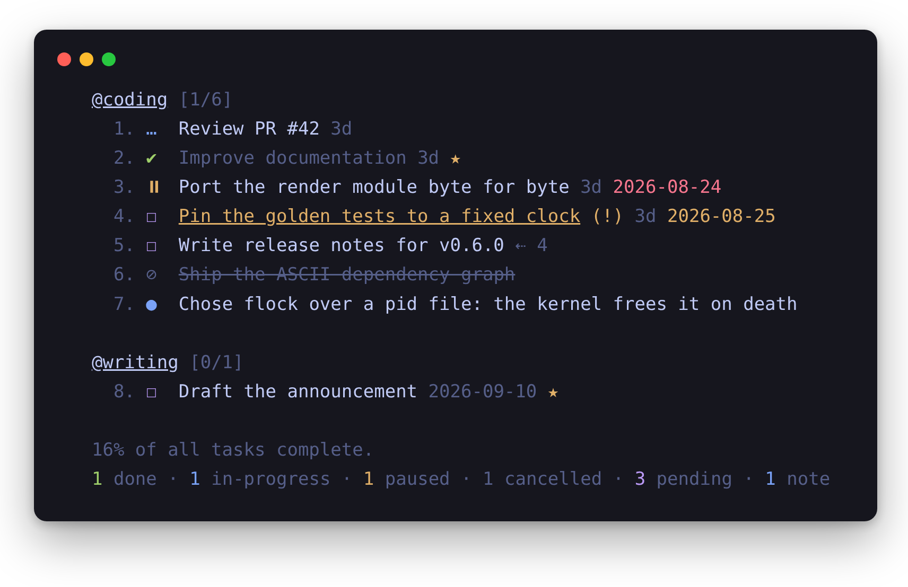
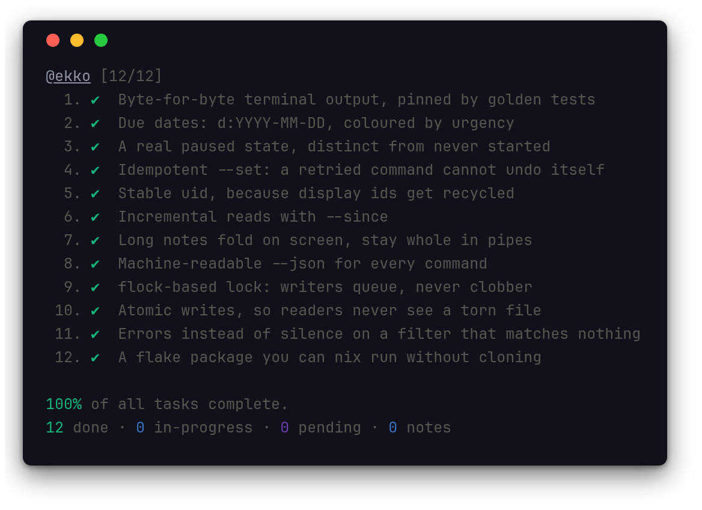
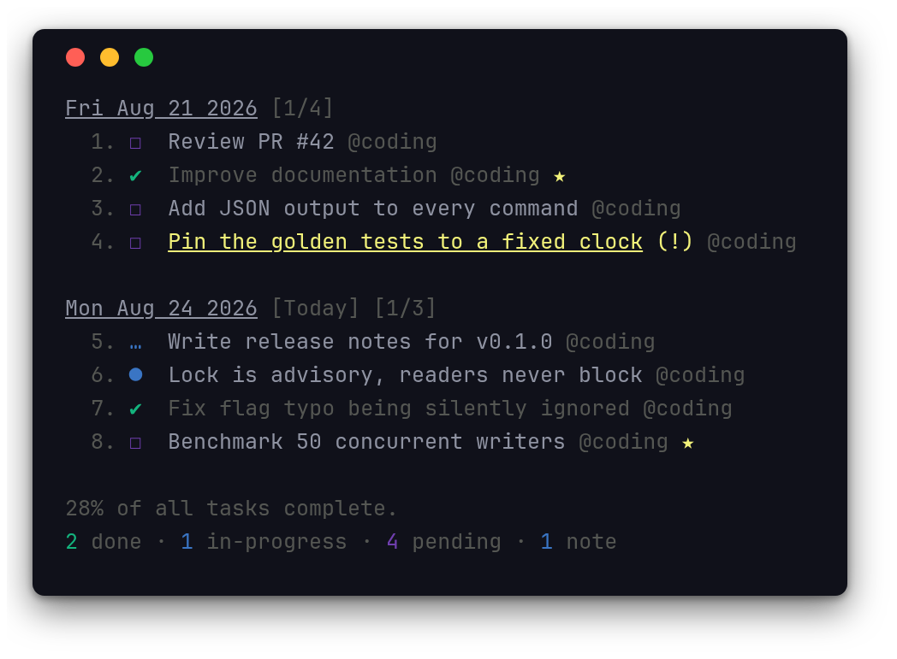
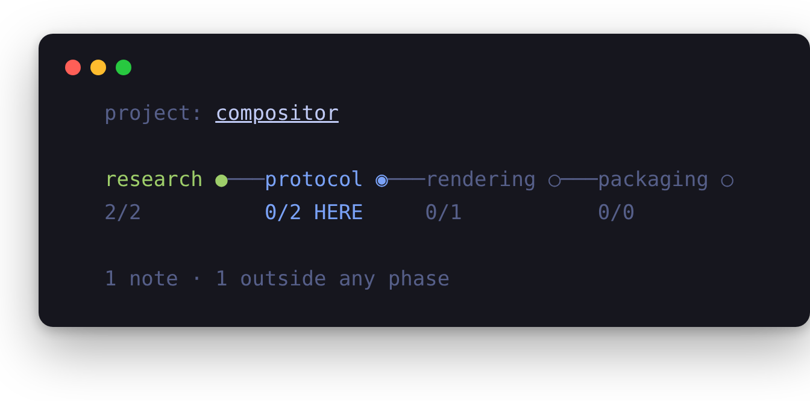

<h1 align="center">
  Ekko
</h1>

<h4 align="center">
  Tasks, boards & notes for the command-line habitat
</h4>

<div align="center">
  
</div>

## Description

Ekko is a pure-Rust rewrite of [taskbook](https://github.com/klaudiosinani/taskbook). It began as a faithful port -- the terminal output is still byte-for-byte identical for anything taskbook could produce, pinned by golden tests that diff against output captured from the real JavaScript build -- and everything underneath was rebuilt: machine-readable `--json` for every command, a `flock`-based cross-process lock so two invocations writing at once cannot silently clobber each other, and the JS test suite carried over and grown.

It has since grown past the original where the original was in the way. Due dates, a real paused state, retry-safe state changes, stable per-item ids and incremental reads are all Ekko's, and none of them disturb a board that does not use them. Where taskbook silently returned a plausible wrong answer, Ekko errors instead.

Effectively a task manager built to be driven by a human and an LLM/coding agent working the same boards at the same time, which is exactly the property the rewrite exists to make solid.

## Highlights

Inherited from taskbook, and rendered identically:

- Organize tasks & notes into boards
- Board & timeline views
- Priority & favorite mechanisms
- Search & filter items
- Archive & restore deleted items
- Progress overview
- Configurable through `~/.ekko.json`, data in plain JSON at `~/.ekko/storage`

Added by Ekko, each of them invisible until you use it:

- **Due dates** via `d:YYYY-MM-DD`, coloured by urgency and filterable with `--list due|overdue`
- **A real paused state**, so "set aside" stops looking like "never started"
- **A waiting state**, for work held by something outside the board, which `--list ready` and `--next` stop offering
- **Who a task is with**: `with:NAME` and `--with`, so work that is yours, a colleague's or a client's leaves an agent's queue and is listed by name
- **Who wrote each item**: the session that wrote it, or you, shown by `--context` and found with `--list by:NAME`
- **Commits linked to tasks**: an `Ekko: 469` line in a commit's message, and `--context` lists the commits naming a task, through rebases too
- **A cancelled state**, struck through and kept, because deleting loses why the work was dropped
- **Projects**: a board per folder or repository, made with `ekko init` and found from inside it the way git finds a repository
- **Phases and `--roadmap`**: a project's roadmap, read backwards as history and forwards as a plan
- **Docs from the board**: `ekko docs` writes the project's documentation as markdown -- its decisions, gotchas and procedures, its history, and a page per task -- by code, with no model, in a fraction of a second
- **Plans to approve**: an artifact holds the plan for one goal across sessions -- its design, its risks, its steps in order -- on a page in your browser that follows every change, and your answer in Ekko's menu makes its steps into tasks
- **Sessions for tasks**: `ekko agents start` hands a task to a Claude Code session born for it, with the model and effort you pick, in a worktree of its own and a tmux window you can step into, whose status line shows it working, waiting on you or idle, and leaves pushes, releases, new sessions and the rest of the board to you and the orchestrator
- **Dependencies**: `--blocked-by`, so a task cannot be completed while what blocks it is open, and `--list ready` for what can actually be started
- **`--set`**, an idempotent alternative to the toggles: a retried command cannot undo itself
- **Stable `uid`s**, accepted anywhere a display id is, because display ids get recycled and `--restore` hands out new ones
- **`--since`**, reading only what changed rather than the whole board every time
- **Folded notes** on screen, whole in pipes and `--json`
- **Typed notes**: a decision, a gotcha or a procedure, written on purpose, and `--supersedes` for the one it replaces -- what stays true after the work is done
- **Gotchas that refuse**: a gotcha's command cue, once you turn it on in Ekko's menu, refuses the Bash calls it names, and a refused call goes through once on your answer
- **Failures that repeat**: `ekko --repeats` reads the project's Claude Code transcripts and lists the failed tool calls seen in 2 or more sessions on 2 or more days, grouped by fingerprint with no model, for a gotcha to stop them
- **A doctor**: `ekko --doctor` names each Claude Code session still running an ekko an upgrade replaced, or whose plugin hooks did not run, read from `/proc` and the hooks' own records; the prime names those on its own board
- **Errors instead of silence** when a filter term matches nothing
- **A `flock` lock and atomic writes**, so concurrent invocations queue rather than lose updates
- **Stash and trash**: put finished work out of the way and keep it reachable, or remove it with 30 days to change your mind
- **A project memory**: `memory.md` in the board's folder, one page on what the project is as a whole, which you keep and the plugin adds to each session's context when it starts, clears or compacts; a longer page is cut at 6,000 characters with a line saying so
- **An agent frontend**: `ekko --mcp`, a Model Context Protocol server with the resume view, the work order and structured writes, packaged as a Claude Code plugin that starts each session with the board in context
- **A reproducible `nix develop` shell**, and a flake package you can `nix run` without cloning

<div align="center">
  
</div>

## Contents

- [Description](#description)
- [Highlights](#highlights)
- [Install](#install)
- [Usage](#usage)
- [Views](#views)
- [Agents](#agents)
- [Configuration](#configuration)
- [Flight Manual](#flight-manual)
- [Development](#development)
- [Credits](#credits)
- [License](#license)

## Install

With nix, nothing needs cloning:

```bash
$ nix run github:thiagoproldan/ekko -- --help
$ nix profile install github:thiagoproldan/ekko
```

The flake also exposes the Claude Code plugin as `packages.plugin` -- the MCP server (`ekko --mcp`), a SessionStart hook running `ekko --prime`, and the hooks that draw the board in the session's task list -- with the binary pinned by store path, so the plugin can never drive a different revision of ekko than the one it was built with. Outside Nix, `claude --plugin-dir plugin` loads the same plugin from this repository against the `ekko` on your PATH.

With cargo, from a clone:

```bash
$ nix develop           # Rust toolchain: cargo, rustc, clippy, rustfmt
$ cargo install --path . --locked
```

That lands the binary in `~/.cargo/bin`, which your shell may not read. To build without installing: `cargo build --release`, and the binary appears at `target/release/ekko`.

Ekko is developed and tested on Linux. The parts that touch the OS are POSIX -- `flock(2)` for the storage lock, `ioctl(TIOCGWINSZ)` for the terminal width, `SIGPIPE` restored to its default -- but the clipboard backend behind `--copy` is built for Wayland, and nothing else is exercised by CI.

## Usage

```
$ ekko --help

  Usage
    $ ekko [<options> ...]
    $ ekko init [<folder>] [--name <name>]
    $ ekko docs [<folder>] [--project <name>]
    $ ekko artifact <id> [--project <name>] [--no-open]
    $ ekko serve [--idle <seconds>] [--stop]
    $ ekko agents start <task>... --model <model> [--effort <level>] [--project <name>]
    $ ekko agents view [--once] [--project <name>]
    $ ekko agents wall
    $ ekko agents unwall

    Options
        none              Display board view
      --answer <ID>       Answer a question asked on the board; the id alone opens a menu
      --archive, -a       Display archived items
      --attached-to <IDS> Attach a note to the task it explains
      --begin, -b         Start/pause task
      --blocked-by <IDS>  Record what an item is blocked by
      --check, -c         Check/uncheck task
      --clear             Delete all checked items
      --context <ID>      Show one item with its dependencies and notes
      --copy, -y          Copy item description
      --delete, -d        Delete item
      --destroy           Move a project's board to the trash
      --dismiss <IDS>     With --repeats: set fingerprints aside until they recur again
      --doctor            Check that every Claude Code session runs ekko's current binary and its hooks; exit 1 on a fail
      --probe             With --doctor: write the board again, then wait for each session on it to hear it
      --edit, -e          Edit item description
      --find, -f          Search for items
      --force             Override the blocked-by rule or a running session's hold
      --help, -h          Display help message
      --json, -j          Output machine-readable JSON instead of formatted text
      --link-project <NAME> Link this project's board and NAME's, for Claude Code sessions
      --list, -l          List items by attributes
      --mcp               Serve the board to an agent over MCP (stdio)
      --resources         With --mcp: serve only the board as @-mentionable resources
      --move, -m          Move item between boards
      --move-to <PROJECT> Move items to another project's board, or ~ for the default one
      --next [N]          List what to take up next, best first
      --note, -n          Create note
      --kind <KIND>       With --note: a decision, gotcha or procedure
      --supersedes <ID>   With --kind: the earlier note of that kind it replaces
      --phase <NAME>      Scope work to one phase of a project
      --phases <NAME>...  Declare the project's ordered phase sequence
      --prime             Summarise the board for picking work back up
      --hook              With --prime, --memory, --tasklist, --guard or --born: answer a Claude Code hook's event on stdin
      --memory            With --hook: put the project's memory page in a starting session's context
      --tasklist          With --hook: draw the board in the session's Claude Code task list
      --guard             With --hook: refuse the Bash calls a gotcha's cue names
      --refuse <REASON>   With --guard: another guard's refusal, which the user may let through
      --born              With --hook: say when a session ekko agents started waits on the user, and close it once its tasks are finished
      --priority, -p      Update priority of task
      --project <NAME>    Work against a named project instead of the default board
      --projects          List the projects that exist
      --repeats           List the failed tool calls that repeat across this project's sessions
      --restore, -r       Restore items from archive
      --roadmap           Show the project's roadmap through its phases
      --sessions          Show each Claude Code session on this board and its work
      --set               Set item state idempotently (retry-safe)
      --since <MILLIS>    Only items changed at or after a timestamp
      --star, -s          Star/unstar item
      --stash [IDS]       Put items or a board away; no ids lists the stash
      --trash             Show the trash, and how long each thing has left
      --unlink-project <NAME> Take away the link between this project's board and NAME's
      --unstash <IDS>     Bring items back out of the stash
      --untrash <IDS>     Bring items back out of the trash
      --ekko-dir          Define a custom ekko directory
      --task, -t          Create task
      --timeline, -i      Display timeline view
      --version, -v       Display installed version
      --with              Say who a task is with; no name, nobody

    Examples
      $ ekko
      $ ekko init
      $ ekko agents start 12 --model sonnet --effort high
      $ ekko agents view
      $ ekko --archive
      $ ekko --attached-to @16 12
      $ ekko --begin 2 3
      $ ekko --check 1 2
      $ ekko --check 2 --force
      $ ekko --clear
      $ ekko --context 12
      $ ekko --copy 1 2 3
      $ ekko --delete 4
      $ ekko --doctor
      $ ekko --doctor --probe
      $ ekko --edit @3 Merge PR #42
      $ ekko --find documentation
      $ ekko --project old --destroy
      $ ekko --json --task @coding Review PR #42
      $ ekko --list pending coding
      $ ekko --list with:rodrigo
      $ ekko --move @1 cooking
      $ ekko --move-to zettelkasten 3 5
      $ ekko --next 5
      $ ekko --note @coding Mergesort worse-case O(nlogn)
      $ ekko --note --kind gotcha Run the migrations before the tests
      $ ekko --note @coding - < why.txt
      $ ekko --prime
      $ ekko --priority @3 2
      $ ekko --repeats
      $ ekko --restore 4
      $ ekko --project demo --roadmap
      $ ekko --star 2
      $ ekko --stash @due
      $ ekko --unstash 9
      $ ekko --task @coding @reviews Review PR #42
      $ ekko --task @coding Improve documentation
      $ ekko --task Make some buttercream
      $ ekko --task Send the contract with:rodrigo
      $ ekko --timeline
      $ ekko --with @3 rodrigo
```

## Views

### Board View

Invoking Ekko without any options will display all saved items grouped into their respective boards.

<div align="center">
  
</div>

`--ui`, an interactive mode, was removed. The flag still parses, but only to say so and point to this view (`REMOVED_FLAG`), so someone who types it from habit is told where the board is instead of guessing at a typo.

### Timeline View

In order to display all items in a timeline view, based on their creation date, the `--timeline`/`-i` option can be used.

<div align="center">
  
</div>

### Roadmap View

Inside a project with declared phases, `--roadmap` shows the project's way through them: filled for what is behind, marked for the phase holding work now, hollow for what is still ahead. The same picture reads backwards as history and forwards as a plan.

<div align="center">
  
</div>

Anything created in the project without `--phase` sits at the project root, outside the roadmap, and is counted at the foot rather than guessed into a phase. See [Phases and the roadmap](#phases-and-the-roadmap).

This was `--path` until it was renamed. The old name still parses, only to answer with this one (`RENAMED_FLAG`), so a script or an agent that remembers it is told where the feature went rather than that it is gone.

## Agents

Ekko has a frontend for each kind of reader: the board for a person, and for an agent, a server of its own.

### The MCP server

`ekko --mcp` serves the board over the [Model Context Protocol](https://modelcontextprotocol.io) on stdin and stdout, until stdin closes. It speaks the handshake revisions (`initialize`, 2025-11-25 back to 2024-11-05), and answers a request of the 2026-07-28 revision, whose `_meta` names it, statelessly, `server/discover` included, which Claude Code probes with first. Under either, `ask` waits for your answer in ekko's menu; the client's own dialog is a request of the server's under the handshake and an `input_required` result under 2026-07-28, answered on the call's retry. The resources server tells a client of the handshake that the list changed, and a 2026-07-28 client on the `subscriptions/listen` stream it opens.

| tool | what it does |
|---|---|
| `prime` | the resume view: the other sessions on the board and what each holds, in progress, ready in order, blocked, recent notes, gotchas and procedures, what needs attention, and a cursor |
| `next` | what to take up next, best first |
| `context` | one item with its blockers, what it blocks and its notes, in full; who wrote it, and the commits naming it |
| `search` | items matching a text and/or the `--list` filters, with a count of the stashed ones that match as well |
| `changes` | what was written since a cursor, including items stashed or trashed since |
| `roadmap` | as the flag of the same name |
| `create` | a task, a note, a handoff, or a decision, gotcha or procedure, with every field apart from the text, relations included |
| `set_state`, `force_state` | idempotent state changes; `force_state` overrides the dependency rule and a running session's hold, and is a tool of its own so it can be permissioned apart |
| `edit` | the whole text, one exact replacement, or an append -- optionally conditioned on the `updatedAt` last read |
| `update` | boards, priority, due date, who a task is with, phase, star, a note's kind |
| `link` | `blocked_by`, `attached_to`, or `supersedes` |
| `batch` | several of the writes above in one write, all or nothing, with `$1`, `$2` naming the items earlier operations created, in the fields that take an item; a text keeps them as written, and the reply names the item each one is |
| `ask`, `answer` | questions for the user, put to them in Ekko's menu and kept on the board until each reply is recorded; see Questions below. With `cue` or `allow`, a question proposes a gotcha's cue or asks to let a refused call through; see Guards below. With `link_project`, it proposes linking two projects; see Linked projects below. With `approve`, it puts an artifact's plan to the user; see Artifacts below |
| `artifact` | the plan for one goal, kept across sessions: a task whose text is the plan and whose steps become tasks once the user approves them; see Artifacts below |
| `wait` | wait on a task another session or the user holds, or on a question, and be told once it is over; see Waiting below |
| `stash`, `trash` | put items away, or bring them back |
| `away` | what is put away: the stash, and the trash with the days each item has left, one line per item |
| `phases` | declare the project's phases in order, replacing the sequence; answers with the roadmap |
| `move_to` | as `--move-to`, to a project by name or `~`: at once to a board the user linked, and to any other only once the user lets that exact move through; see Moving items to another project |

There is no `clear` and no `destroy`: an agent that needs either asks the user to run it. Nor does any tool list the projects: a session works on its own board, the one its folder finds or `EKKO_PROJECT` names at launch, and on the boards the user linked to it (see Linked projects below), which every tool reaches with `project`. Any other project's board is the user's to open, with `ekko --project` in a command they see, and a call naming one is refused before either board is read.

**Handoffs.** A long session is cheaper to clear and resume than to carry, as long as what it knows survives the clear. `create` with `kind: "handoff"` writes that: a note on the open task the session was working, saying where it stopped, what it decided and why, the files and lines, the next step and the open questions. The next prime quotes a handoff on open work in a section of its own -- the one this session wrote, when it wrote one (see Several sessions), else the newest -- line by line, up to 3,500 characters on top of the prime's 6,000. A longer one keeps its head and its end -- from its last line opening a next step (`Next step:`, `NEXT STEP`), else its last lines -- with a line between them counting what it left out, which `context` reads whole (task 1456). The prime as a whole stays under 9,500 characters, below the 10,000 Claude Code keeps of a hook, past which it hands the session a file path and a preview instead: when the questions, answers and waits it lists before its sections would pass that, each of those lists keeps its first entries and counts the rest, saying where they are read, and the sections spend what is left (task 1455). Under a handoff, the prime lists only the loose notes changed after it: the older ones are history the handoff had the chance to take in, so a note the next session must read is named in the handoff by id. A new handoff on the same task demotes the one before to an ordinary note, unless another session that still runs wrote it, and one moved to another task, or detached, is an ordinary note too. The server also offers `handoff` as an MCP prompt, which Claude Code lists as a slash command: it asks the agent to write the handoff now, naming the task in progress and the handoff it replaces.

**Typed notes.** A handoff is the half of what a session learns that expires; the other half stays true after the work is done. `create` with `kind` `decision` (what was settled, and why), `gotcha` (a trap, and how to avoid it) or `procedure` (steps that work) writes it -- loose, for the whole project, or attached to the task it explains, where it keeps its meaning after that task is done. `supersedes` names the earlier note of the same kind it replaces: the older one stays as history, marked superseded wherever it is listed, and stops being shown as current; trash the newer one and the older is current again, with nothing to undo. The prime lists the five newest gotchas and procedures by their first line and counts the decisions, which `search` with the `decision` filter reads. `update` gives a note written before a kind, and `link` changes what one supersedes. Nothing is captured behind anyone's back: every typed note is written on purpose, by the user or the agent.

**Several sessions.** Every Claude Code session on a board sees the same board, so a task in progress names the session holding it: its terminal's Claude Code process, as `trabalho on pts/5 · a6b026e6` -- the profile, the terminal, and the conversation to resume. A /clear starts a new conversation in the same process, and the SessionStart hook records it, outside the board, in `$XDG_STATE_HOME/ekko/processes`, so the name always gives the one to resume. Another session that still runs is refused (`HELD`) when it would change that task's state, stash it or trash it, through the tools or through `ekko` in its shell; `next` and the task list leave the task out and name it apart. A person at the terminal is never refused. When a session ends, its work is free to take up, with a notice saying so; and a conversation resumed after a restart -- every upgrade restarts every session -- takes back what it held. So does a conversation Claude Code moves out of its terminal into a background session, while the terminal's process still runs: the `continued-in` record Claude Code leaves at the end of the old transcript names the session that carries it on, which keeps its tasks, its handoffs, its waits and the answers to its questions, and `ekko --sessions` lists what it did in the old process under that session. A handoff says whose it is the same way, by the session that wrote it, since it often sits on a waiting or pending task that nobody holds: the prime leads with the one this session wrote -- in its process, which a /clear or a compaction keeps, or in the conversation it resumed or carries on -- whatever state its task is in, then with one a session that has ended left for anyone, and last with one another running session will resume itself; and it says whose it shows. A handoff whose task another running session holds is that session's, whoever wrote it, and so is one on an artifact one of whose steps it holds, since a session that resumes a plan claims its next step and never the plan itself: the prime ranks it last and names who holds it, and through which step, and the session holding the step reads it as its own (task 1562). A handoff from before 0.19.0 names no author and ranks by its task alone. A finished task records whose work it was, so each session's task list checks off its own. `ekko --sessions` shows the user each session on the board, idle ones too, and each that ended while holding work: what it holds, what it finished today, what it asked that waits, what it waits on, and the command that resumes it. A session claims its task before it changes anything for it (task 1560): the server's instructions say so, and the board helps at the steps where the claim was missed. The prime names the other sessions running on its board and what each holds, one holding nothing too, as `Other sessions on this board: trabalho on pts/1 · 897fb788 holds 1110; trabalho on pts/5 · e4876557 holds nothing`. A write that finishes or cancels the last task a session holds, while another session runs on the board, tells it to set the next one in progress before it starts it. And the guard (see Guards) reads each Bash call for its task: creating a branch `task-N` -- `git worktree add -b`, `git checkout -b`, `git switch -c` or `git branch` -- claims task N for the session, as Linear's one shortcut names the branch, assigns the issue and moves it to In Progress, unless another running session holds it or it is done; and a commit whose `Ekko:` trailer names a task the session does not hold -- pending, or another session's -- is told so beside its result. Neither refuses the call, and both work only on a project's board, whose repository the trailer and the branch belong to. In two Claude Code 2.1.295 sessions on a scratch project, running this build through `--plugin-dir` (2026-10-09), `git checkout -b task-1` in one set task 1 in progress under it and put the claim in its context; a commit naming task 1 in the other was told which session held it; the other's prime named the first and the task it held; and the first's set_state done of task 1 carried the notice. The guard took 4.9 ms on a call naming no task, as before (5.0 ms), and 15.1 ms on a commit naming one, which reads the board, against 4.8 ms before (medians of 300 interleaved runs of each release build on this repository's board, load average 4 to 5).

**Questions.** A question for the user is an item too, since one held only in a session's prompt is lost when that session clears or restarts, and the answer given in another session never reaches it. `ask` records up to four at once, attached to the task they are about, then puts them to the user in Ekko's own menu and waits: its reply carries the answers. A server cannot draw inside Claude Code's screen, and the form Claude Code draws for one makes each option a dropdown, so the menu is a terminal of its own running `ekko --menu` -- a popup over the pane inside tmux, or else a window of a terminal found on `PATH`, `$TERMINAL` first, Konsole sized to the menu; `EKKO_TERMINAL` names another command to open it with, or `none`. It shows each question with its explanation under it and lists its options to pick with the arrows or a number, several with the space bar where the question allows, opening on the recommended one; beside the one in focus it shows why one would pick it, an example of it and a preview, "Other answer…" writes another, and Tab adds a note that goes with the answer; several questions end in a review, and nothing is recorded before it. A question assumes no one followed the work (task 979): unless it is `quick` -- push this? commit that? -- it carries `explain`, one option `recommended` (one or more with `multiple`), and `why` and `example` on every option, or ask refuses it and says what is missing; a question with `cue`, `allow`, `link_project` or `approve` is no exception, `quick` or not (task 1044): it offers exactly two options, written for the user in their language: the first applies what it proposes, whether or not a note goes with it, and the second leaves things as they are. Ekko adds what it applies under the explanation. The board's note keeps the explanation and marks the recommended option, and the question keeps each option's why, example and preview beside it, in `aids` (task 1110), so `ekko --answer ID` and an artifact's page show what the menu showed. A key counts only once the menu has been up, or back in focus, for a second and the keyboard has been quiet for 0.4 seconds, and the space bar only marks, so typing meant for another window as the menu opens answers nothing. A menu left 20 seconds without an answer sends a desktop notification. Where no menu can open, a single question with a single choice goes to the client's own dialog instead, in a client that declares one. A question left with Esc, or that nothing could put to the user, stays open: every prime lists the open ones under `Waiting on you`, with who asked and how many writes ago. `answer` -- or `ekko --answer ID TEXT` at the terminal, or `ekko --answer ID` alone, which opens the menu there -- records the reply, once, which closes it, and the session that asked reads it in its next prime, after a /clear or a restart too, with how far the board moved before it came.

**Waiting.** A session that needs work another holds -- a task in progress in another session, a task with the user, a question -- waits on it with `wait`, instead of watching the board in a loop of its own, which a /clear or a restart loses and nobody else sees. The wait is a note attached to the task, holding who waits and until what -- `done` (the task is done or cancelled), `free` (it leaves its holder's hands: out of progress, its session ended, or taken up by the one waiting) or `answered` (a question) -- and, as its text, what the session will do then, which the holder reads and a session woken after a /clear acts on. The holder sees the wait in its prime, under `Other sessions wait on your work`, and once in its next reply; `ekko --sessions` lists it under the session waiting; and a `HELD` refusal names `wait` as the way to be told. Every write checks the open waits: the one that ends a wait records how and by whom, and tells its writer whose wait it was. The session waiting is told once, whichever way reaches it first. In Claude Code, the plugin's FileChanged hook runs `ekko --wake --hook` in the background on every change to the board's file, and its exit 2 wakes a session sitting idle with what happened and what it meant to do then; the hook is `asyncRewake`, which Claude Code 2.1.282 has. In any client, the session's next ekko reply ends with the same line, and its prime lists the wait under `Waits over, for this session` for a day. A wait on an item of a board linked to the session's, made with `project`, is kept on that board, beside its item, and told the same ways, each line naming the board: the hook runs on the file of each board linked when the session started, and a reply reads every linked board; the prime lists only the waits on its own (task 1443). A question the session's `ask` left open is a wait on its answer: one given later, in a terminal, reaches it the same way, while one given as `ask` waited came back in its reply. What each session was told is kept outside the board, in `$XDG_STATE_HOME/ekko/told`, a marker per line, so reading the board still writes nothing to it. Beside the markers, each run of the hook on the board's file writes `heard`: the version of the file it saw -- its inode, modification time and size -- the revision it read, and when, for a check that a session's hook still hears the board (task 1281).

**Guards.** A gotcha says what went wrong; a cue makes it refuse the call that does it again. `ask` with `cue` proposes one for a gotcha: the command as a call names it (`gh`, `cargo`), the words its arguments, or what is fed to it, must all hold, and, if it applies elsewhere than the board's own, a folder. The session explains the question and writes its two answers in the user's language, the first turning the cue on; Ekko adds the cue and the gotcha as it reads them under the explanation, and only that first answer, given in Ekko's menu, turns it on; changing or dropping a cue that is on takes their answer as well (`cue` with `off`), and a session's write that would change one anyway is refused, `CUE_IS_USERS`. The plugin's PreToolUse hook on Bash, `ekko --guard --hook`, then refuses each call a cue names, with the gotcha as the reason. Each run, whatever it answers, writes `guarded` in the session's folder under `told/`: the call's `tool_use_id` and when, for `ekko --doctor` to tell a session whose hook does not run (task 1284); it added 0.2 to 0.3 ms to a run of about 2.5 ms (500 runs of each build, interleaved, on this machine, 2026-10-09). A gotcha marked to recheck (see Typed Notes) refuses all the same, since only the user turns a cue off, and its reason says why it may be stale, its anchors read as the call is refused (task 1328). It reads the command as the shell runs it -- `&&` and `;`, pipes, `bash -c`, `$(...)`, heredocs and here-strings, `cd` and `pushd`, and the call a wrapper runs: `timeout`, `env`, `nix develop -c`, `nix shell --command` or `direnv exec` (task 1076) -- so a call is judged by the folder it runs in, and text that only mentions the words passes: an `echo`, a file a heredoc writes, and a message a call is given, written out, in a `$(...)` or on stdin (task 1077) -- a commit's, a tag's, a merge's, a note's or a stash's with `git`'s `-m` or `-F -`, a pull request's, an issue's or a release's title, body or notes with `gh`, `--body-file -` included, and the words of an `ekko --task`, `--note` or `--edit`. A query sent through `gh api` is no message, and still counts. Replayed over this machine's 31,257 Bash calls of 2026-08-04 to 10-09 (tasks 1074 and 1078), the two took away all 10 false alarms a cue on `git clean` would have raised, every one a commit message, and let a cue on `cargo fmt --all` see 70 calls instead of 1, with no false alarm. Past these two, the parser reads as [ctx](https://github.com/thiagoproldan/ctx)'s does. A cue on a project's board guards the project's folder, one on the default board the whole machine, and one with a folder of its own that folder (`/` for the whole machine, from any board). The cues that are on, from every board, are read from an index in `guard/` under the default board's directory, rebuilt when a board changes, and only a command holding a cue's command is parsed. Every board means the default board and the registered projects': a board opened elsewhere through `EKKO_DIR` or `--ekko-dir` is neither, so `ask` refuses to propose a cue there, since it would never refuse. A refusal ends with a short code: the session asks the user through `ask` with `allow` set to it, the menu shows, under the session's explanation, the call as the guard recorded it, not as the session describes it, and the first of the session's two answers lets that exact call through once -- from the same folder, for the same session, within 24 hours -- and records on the question the tool call that used it. Another guard refuses through the same codes: `ekko --guard --refuse REASON`, with the PreToolUse event on stdin, exits 0 when the user let the call through, and otherwise records the refusal and prints what to end it with, exit 1: the reasons Ekko's cues and any other guard gave for the same call, then how to ask. [ctx](https://github.com/thiagoproldan/ctx)'s guards ask it before refusing, so one answer lets a call through both. Claude Code runs the hooks at once and shows the model only the reason of the last to finish refusing, so each guard's reason carries the others' recorded by then. ctx's always carries the gotcha's, since `--refuse` works out Ekko's cues itself, and Ekko's carries ctx's once ctx has recorded it; the one gap is Ekko recording first and still finishing last, in the moment between its record and its exit (ctx finished last in 20 runs of 20). Only an answer given in the menu counts, told apart by the process tree, as authors are (see Who Wrote It): an answer a session records turns no cue on and lets no call through. The guard is for accidents, not a hijacked agent: a hook sees only the literal call, not what a script it runs does.

**Artifacts.** A goal bigger than a task -- a feature, a migration -- wants its plan written before its work, read by the user, and kept past the session that wrote it, which neither a session's plan mode nor a chat's artifact does: each belongs to the conversation that made it. `artifact` writes one; it is not Claude Code's tool of the same name, which publishes to claude.ai. An artifact is a task whose text is the plan, in Markdown: a title line, then `## Goal`, `## What is known`, `## Design` and `## Risks and open questions`, each heading on a line of its own, in that order. Its steps, up to 40, come in order, each with a key (`field`, `page-2`), the text its task will say, `done_when`, and `after`, the earlier steps it waits on. Being a task, it takes the decisions and questions about the plan as notes attached to it, and is blocked by the work it plans. Its text changes through `edit`, as any item's does, and its steps through `artifact` again, which writes them all over; each change to either is a new version of the plan, and the artifact keeps the last 10 texts it replaced. `ask` with `approve` puts the plan to the user: the session explains it and writes the two answers, as with a cue, and Ekko adds under the explanation the tasks the approval would make. Only the first answer, given in Ekko's menu, makes them: one per step not approved yet, in the plan's order, each blocked by the tasks of the steps it waits on, on the artifact's boards, priority and phase, recorded on its step, and blocking the artifact, which cannot be completed before them. A plan changed since the question was asked, or an artifact closed since, makes nothing, and the session asks again; a step added after an approval makes its task at the next one. An approved step stays as it was approved: its task is where it changes from then on, and a write that drops it from the plan is refused. The user reads the plan on a page: `ekko artifact <id>` writes it as a single HTML file, in `artifacts/` under the board's directory, its fonts beside it in `artifacts/fonts/` and nothing fetched from the network, and opens it in the default browser, as `cargo doc --open` does (`--no-open` prints its path instead). It is built as akqa.com builds its pages (task 1367): scenes the window's width, told as one scrolls, each light or dark, the page crossfading to the mode of the scene in the window's middle, and what a scene holds coming in from a blur as it comes into view, all still under reduced motion and plain in print. Where the plan stands and its title open it; then the Goal, its first sentence set large and held in the window while the scroll lights its words one by one, the rest of the Goal coming after them (task 1369); What is known with each group of findings, a paragraph and the list after it, behind a tab, each finding a card on a track that comes in from the right as one scrolls and opens in place to the whole of it, by a click, Enter or its button, Esc closing it, the arrow keys and the buttons under the track moving it a card at a time (task 1370); the Design with the points of its first list of three or more told one at a time, beside a numeral held in the window that turns to the point at its middle, lit while the others grey, and a tick for each point that leads to it (task 1371); the Risks and open questions as a stack of sheets, one in front and the next two under it, each saying whether it is a risk or an open question, which Next and the arrow keys deal one at a time and a switch lays out all at once (task 1372) and, turned back, keeps where it was pressed, the stack above it (task 1395); then each other section of the plan opened by its heading, rendered from its Markdown, with any raw HTML in it shown as text; its steps with their tasks as they are now, on a stage one at a time when there are two or more (task 1373): the first not done, whole, with a segment for each step above it, the steps it waits on as chips that lead to them, Back, Next and the arrow keys bringing the next in from the side one moves toward, and a switch to the whole list, where each step opens in place to the rest of its text, which turned back keeps where it was pressed; a jump to a step, from the bar or the map, puts it on the stage; and a map of what waits on what, which plays once it comes into view (task 1374), a stage at a time, each step a stage past the latest it waits on: a stage not reached faint and the curves to it undrawn, Play and Pause, a slider through the stages and a line saying each and the steps it adds, a map wider than the window following the stage along its strip, and a step pointed at lighting what it waits on and what waits on it, all the way along; a reload keeps the stage and plays nothing again, and under reduced motion the map shows whole; the notes attached to it and the comments on it, one scene with a tab each when both are there (task 1375): the notes as rows, newest first, with a pill for each kind that shows that kind alone, each row opening its note in a sheet from the right, a modal dialog that keeps Tab in it and that Esc or a click outside closes, the note going back to its place; a jump to a note, from the bar, opens its sheet, and one to the comments picks their tab; and what each change to its text changed, line by line (task 1376): the texts the plan kept as points on a line, oldest first, each under the date it was made, and the changes between them one at a time, the newest first, a click on a point or a slider from the oldest at its start picking another; and what comes next (task 1377), a dark scene the window's height: the review the plan waits on, or else its first step neither done nor cancelled, with Review where the page writes as the user, a button that puts that step on the stage, Copy and Back to the top. A box above the plan says when a question waits on the user: the approval asked, with Review beside it, and each other question open on the artifact or on a step's task, in the order they were asked, shown as Ekko's menu shows it (task 1110) -- its explanation, its options numbered, the recommended one marked and picked to begin with, and beside them, or under them on a narrow window, why one would pick the option in focus or under the pointer, an example and its preview, from the question's `aids`. Where the page writes as the user, the box answers it: an option, or several where the question allows, or "Other answer…" and its words, with a note if one is written, which `POST /api/answer` records, behind the walls of every write, as the menu records the same keys, so an `ask` waiting on the question returns it and closes its menu; the words typed survive a reload, and an answer the question does not take is refused and writes nothing. Bars at the right edge show the scene being read and lead to the others, and the page's mark stays at the top once the first scene has gone by; a bar at the bottom, opened by a click or `/` and folded back by Esc or by a click or the focus going elsewhere, finds a section, step, finding, note or comment as you type, and runs the page's commands, listed first among what the words find or alone after `>`, as in GitHub's command palette: the theme, Copy, which copies the command that opens the page, and, where the page writes as the user, Review, Request changes and, while a question asks to approve the version shown, Approve. The page has no bar at the top (task 1337): the bar's menu offers the theme and Copy beside the page's parts, and Review is a round button beside the bar. What Tab focuses comes into view clear of the two (task 1349), and the page is never wider than the window (task 1403). It is set in Inter and in Ekko Serif, Adobe's Source Serif 4 cut to Latin and renamed, as the licence of a cut font asks, both under the SIL Open Font License ([assets/fonts/OFL.txt](assets/fonts/OFL.txt), made by `scripts/fonts.sh`); a font loads only once the page sets something in it. It follows the system's light or dark theme, which the bar's command switches, and keeps its place, the steps open and each scene as the reader left it when it reloads (task 1378): the step on the stage, the tab picked, the cards open, the note in the sheet, the risk in front, the change shown and the stage of the map, which stays whole when it was, as History stays on the newest change. Every jump shows what it goes to first: from the bar, the index or the map, by a link in the page or by an address ending in `#` and an id, a step off the stage comes onto it, a card on a tab not picked has its tab picked and comes open to the track's start, a risk under the one in front is dealt to, a note opens in its sheet and a change on the slider shows; a comment opened shows the part its words are in the same way. Every write that changes what a page shows rewrites it, whatever made the write -- a session, the CLI, the menu -- and the page open in the browser reloads within two seconds: every two seconds it loads a script written beside it, which holds its version, a read of the disk Firefox allows a page opened from a file (measured in Firefox 157; Chromium was not tried). A board where no page was ever written pays for this with a look for a folder that is not there. The address `ekko artifact` opens and the artifact tool's reply gives is the page from `ekko serve`, a local server, one per user, which either starts when none runs: `http://127.0.0.1:<port>/default/<uid>.html` for the default board, `/project/<name>/<uid>.html` for a project's. It reads the board at each request, so its page is current without a write, and an open tab follows the board through `/events`, a stream of Server-Sent Events that names each page a write changed, with its new version. A browser keeps one such stream for all its tabs, since over HTTP/1.1 it keeps at most six connections to a server: the tab holding the Web Lock `ekko-events` opens it and passes each version on to the others over a BroadcastChannel, and another tab takes the lock when that one closes. A version that comes while a comment, or any field but the bar's search, has the focus waits until it loses it, so no words being typed are lost; the bar's search keeps its words across the reload. It listens on 127.0.0.1 only, and answers only a Host naming that address or `localhost` at its port, against DNS rebinding, and only sockets the user owns, read from `/proc/net/tcp` (on Linux only; elsewhere other local users are answered too). Its runtime file, `serve.json` in ekko's state directory (`$XDG_STATE_HOME/ekko`, else `~/.local/state/ekko`), holds its pid, port, version and a token, readable by the user alone; an ekko of another version asks it to stop, with the token, and starts its own on the same port, so a tab left open finds it. It stops by itself after an hour without a request (`ekko serve --idle <seconds>` sets another), or once `serve.json` names another server or is gone, and `ekko serve --stop` stops it now; `serve.log` beside it says when it started and stopped, and what it refused. A write from the page, a POST under `/api/`, is the user's alone (task 1103). The server takes one only with the page's own Origin, `http://127.0.0.1:<port>` or `http://localhost:<port>`; only with the cookie a browser gets for the token in `serve.json`, `SameSite=Strict` and `HttpOnly`, once it opens the page through `serve-open.html`, a file beside it readable by the user alone that `ekko artifact` opens in place of the address, which keeps the token off the browser's command line; and only from a process outside every Claude Code session: it finds the processes holding the connecting socket through `/proc`, and refuses the write when a Claude Code process is among the ancestors of one, as authors are told apart (see Who Wrote It), since a session writes with Ekko's tools. Elsewhere than Linux the page reads only. A browser `ekko artifact` starts leaves the process tree of whoever ran it, a session's command included. On load the page asks whom it writes as, with `POST /api/who`, which writes nothing, and says it at the head of History, with the version, when it was updated, who wrote the plan and the board it is from: `writes as you`, or `reads only` and why. There the user comments on the plan. Words selected in it, snapped to whole words, offer Comment and six themes by color, named Note, Question, Problem, Agree, Change and Idea until the user renames them in the bar, which the browser keeps; the key C takes the words in the last theme used, and 1 to 6 in that theme. The comment is written in the bar at the bottom, below the words it quotes, and Enter sends it with `POST /api/comment`, behind the walls of every write. Suggest, beside the quoted words, makes it a suggestion (task 1107): the field takes those words, which the user changes into the words to put in their place, as GitHub fills a suggestion block with the lines selected; what was typed before stays the comment's text, Suggest again gives it back, and a field emptied suggests deleting the words. A suggestion shows as its words struck through and the new ones beside them. It is a note attached to the artifact, written as the user's, whose `comment` field holds the plan's version it was made on, its words as the W3C Web Annotation's quote selector keeps them -- the words, up to 32 characters on either side, and their section -- and its theme's name and color. A comment made on a version the plan has since left, or on words it no longer holds, is refused and writes nothing. It is written pending, and stays so until the user sends it: alone, with Send now where it opens (`POST /api/comment/send`), or with a review (task 1106). A suggestion sent whose words the plan still holds offers Apply there (`POST /api/comment/apply`), which applies it as the artifact tool's `apply` does. Review, the round button beside the bar, with the count of the user's pending comments on its edge, or the key R, turns the bar into one, as GitHub's review box: what it says, and its verdict, Comment, Approve or Request changes; while no question asks to approve the version shown, Approve cannot be pressed and the bar says why. Enter sends it with `POST /api/review`, behind the same walls. It is a note attached to the artifact, written as the user's and shown under its notes, whose `review` field holds its verdict, the plan's version it was made on, the comments it sent -- every pending one of the user's on the artifact -- and the question it answered. Approve answers the open question asking to approve the version the page shows, with the answer that approves, once a second Enter confirms the tasks the bar lists; Request changes answers the newest open question asking to approve the plan with its other answer; Comment answers none. The answer's note names the review and gives the first line of what it says, or else the comments it sent, and the answer is the user's, as one given in Ekko's menu is: Approve makes the tasks, and an `ask` waiting on the question returns it and closes its menu. A review is refused, and writes nothing, on a version the plan has since left, on a closed artifact, with Approve when no question asks to approve this version, and with nothing to send. The sessions working the artifact -- holding it or a step's task in progress, or having asked a question about it still open -- are told each review, and each comment sent alone, once (task 1108): in their next ekko reply, and through the wake hook, as a wait's end is; a review that answers the question a session's `ask` waits on comes back in that reply instead. Where the page writes as the user, a step, on the stage or in the list, whose task may be taken up now -- pending or paused, with no one, and every task it waits on done or cancelled -- has Start (task 1111): `POST /api/start`, behind the same walls, sends the comment `Start this` on that step, told to those sessions as a comment sent alone, with the step's task and what to do: set it in progress and take it up. Until a task's state leaves pending and paused, which resolves the comment, the page says the Start was sent in place of the button. A Start is refused, and writes nothing, on a step whose task may not start, saying why, and on a step sent Start already. Until a session resolves them, the artifact's standing counts the reviews and sent comments, as `1 review and 2 comments to resolve`, in the prime, `context` and the page, so what no session was told reaches the next one. The artifact tool, given the artifact alone, reads the user's feedback after the plan (task 1107): each review, with its verdict, the version, the question it answered and the comments it sent, and each comment sent alone, the open ones first and whole -- where each comment's words are now, found as the page finds them (`current`, `its words changed to "..."` or `outdated`), what it suggests, and the replies to it -- then the settled ones by id, and how many comments wait unsent on the page; `context` marks each such note, as `[comment, sent]`, `[suggestion, applied in version 3]`, `[reply to 12]` or `[review, changes requested on version 2]`, and while any of it is open points to this read under the plan's line; a review that asked for changes has the read end its first line with asking for approval again. The same tool answers it. `apply` puts each suggestion's words where its quote is, in one edit that makes the plan's next version, and marks the comment applied in that version and resolved, as GitLab resolves a thread whose suggestion is applied; a deletion takes a space with its words, as a word processor's smart cut does. It is refused, writing nothing, for a comment pending or applied already, for one whose words changed or are gone, as GitHub refuses an outdated suggestion, and for one whose words the Markdown does not hold as they show, with code, emphasis or a link running through them, which `edit` then changes. `reply` writes a note on the artifact in the thread of the comment it answers, shown under it on the page, and `resolve` settles reviews and comments, which then wait on no session. On the page a comment is its words, tinted in its theme's color, with a pin at their end counting the comments that end there; a click on either opens every comment at that point, where the user edits and deletes their own (`POST /api/comment/edit` and `/api/comment/delete`), a deletion going to the trash; the edit of a suggestion opens on its words. The scene of notes and comments, after the map, lists them in reading order, the outdated last, with filters by theme and for the outdated, and a switch that takes the colors off the text. Each is found again by its words and what is around them, or between the same words when its own changed a little, and one whose words are gone is kept, marked outdated, with the version it was made on. It runs only its own scripts, under a Content-Security-Policy that gives them a nonce per answer, and takes its fonts from the server alone, which serves them under the board's path, `fonts/<name>-<hash>.woff2`, for a browser to keep. Like the guard, this keeps a session from writing as the user by accident, not a hijacked agent, which can start a process outside its tree too. The file page is still written, and stays the page where no server starts, or for a board the server would not find by name, such as a copy `EKKO_DIR` points at; the reply then says why under `unserved`. The prime lists each open artifact on a line of its own, under `Artifacts, open`, with where it stands -- `draft, 3 steps`, `waiting on you: question 12`, `approved, 1 of 3 done, 1 step to approve` -- in place of its line among the ready or the blocked work; `context` lists its steps with their tasks, and says of each of those tasks whose step it is; `search` with the `artifact` filter finds them all.

**Mentions.** `ekko --mcp --resources` is a second server, offering the board as resources instead of tools: `prime://board`, and `item://<id>` for every open task, handoff, and decision, gotcha or procedure in force, each named by its id and the start of its text. Typing `@` in Claude Code lists them, and picking one attaches the item to the prompt, read as `context` reads it, so the agent has it without spending a call. Any id reads, listed or not; closed work and plain notes stay out of the list so it stays one a person can pick from. Claude Code reads the list once, when it connects, and only an item on the list it read can be mentioned, so the server checks the board's revision every two seconds and sends `notifications/resources/list_changed` when the list moved; an item made mid-session, from anywhere, is in the menu at once. It is a server of its own because Claude Code 2.1.278 cannot resolve a mention of a plugin server's resources: it takes the server's name to be everything before the mention's first colon, and a plugin server is named `plugin:<plugin>:<server>`. Register it outside the plugin, under a plain name, for example with `claude mcp add --scope user ekko -- ekko --mcp --resources`, and mention items as `@ekko:item://93`.

A write that is wrong in any way is refused and writes nothing, and the refusal comes back as a tool result reading `CODE: message` -- the codes `--json` uses, plus `INVALID_INPUT` for an argument that makes no sense, `STALE` for an edit made against an older version of the item, and `EDIT_MATCH` for a replacement whose text is not there exactly once. A misspelled field is refused rather than ignored: an ignored `blockedBy` would create the task and silently drop the dependency. Text is never read for `@board`, `p:N` or `d:DATE` the way the CLI reads a description, so prose keeps every word.

Reads come back as plain text and writes as compact JSON, never coloured, whatever `FORCE_COLOR` says.

### The plugin

[`plugin/`](plugin/.claude-plugin/plugin.json) is a Claude Code plugin: the MCP server, a SessionStart hook running `ekko --prime`, so a session starts with the board's resume view in context, the hooks that draw the board in the session's task list, a FileChanged hook running `ekko --wake`, which wakes a session when what it waits on is over (see Waiting), a PreToolUse hook on Bash running `ekko --guard`, which refuses the calls a gotcha's cue names (see Guards) and, in a session `ekko agents start` opened, its pushes, releases and new sessions (see Sessions for tasks), and hooks running `ekko --born` -- on UserPromptSubmit, Stop, PermissionRequest, Notification, PostToolUse, PostToolUseFailure and ElicitationResult -- which say when a session `ekko agents start` opened waits on you, keep its state on its pane for the status line, and close it once its tasks are finished (see Sessions for tasks). The flake builds it as `packages.plugin` with the binary pinned by store path. Placed as a skills-directory plugin, at `~/.claude/skills/ekko/.claude-plugin/plugin.json`, it loads with no marketplace; `claude --plugin-dir plugin` loads it for one session. Its tools are named `mcp__plugin_ekko_ekko__<tool>` for permissions.

It replaced the `/ekko` skill, which sat in every conversation whether the board was used or not.

**The task list.** Claude Code draws a task list under the spinner -- ✔ done, ◼ in progress, with the task's line as the spinner's, ◻ pending -- from the files its TaskCreate and TaskUpdate tools write. The plugin draws the board there instead: `ekko --tasklist --hook` writes the session's own list when the session starts, after each ekko write, and whenever the board's file changes, including from the terminal or another session. The list holds what the session finished, the work in progress, and the next five ready tasks, each under its id on the board. Three settings sit outside the plugin, because a plugin cannot set them:

- `CLAUDE_CODE_ENABLE_TODO_TOOLS=1` in Claude Code's environment. Claude Code offers its task tools, and so draws the list, only on Claude 3.x, Opus 4.0-4.7, Sonnet 4.0-4.6 and Haiku 4.5; on any other model, Opus 5 included, it draws nothing without this.
- `CLAUDE_CODE_TODO_REMINDER_MODE=off`, and the native task tools denied (`TaskCreate`, `TaskUpdate`, `TaskList`, `TaskGet`), so the agent keeps its tasks on the board. The list is the board's, and each write replaces it whole: a task written there any other way would vanish at the next.
- The expanded view: `app:toggleTodos` (`ctrl+t`, which Konsole and others keep for a new tab; `~/.claude/keybindings.json` can move it) switches between the whole list and one `Next:` line, and Claude Code remembers the choice.

None of this is documented by Claude Code: the file format and the rules come from its 2.1.278 binary and from testing it, so a Claude Code that changes them breaks the drawing, never the board.

**Failures that repeat.** A session that fails as an earlier one did -- `python3` not found, a title over 80 characters, an Edit before a Read -- learns nothing from the earlier one unless someone wrote it down. `ekko --repeats` finds those failures without a model (task 1442). It reads the Claude Code transcripts of the sessions begun in the project's folder or in one inside it, a worktree's included: those under `projects/` in `~/.claude`, in each `~/.claude-<profile>` and in `CLAUDE_CONFIG_DIR`, in the folder Claude Code names after the one the session began in, each character but a letter or a digit turned to `-`. Headless runs and subagents are left out. Each tool call marked as an error there counts once, by its `tool_use_id`, since a session begun from another's history repeats its rows. Each gets a fingerprint, as Sentry groups errors: the tool; for Bash, the first command the call ran, as the guard's lexer reads it, unless the message names the command, as `command not found` does; and the message -- its first two lines, or for Bash its `Exit code` line and the output's last, since what fails last prints last -- with quoted text, paths, hashes and numbers taken out. A fingerprint seen in 2 or more sessions on 2 or more days recurs. `ekko --repeats` lists each, most sessions first, with its sessions, days and times, when it was last seen and its latest failure as written; `--json` gives the same. The session at work, or you, write the gotcha from that evidence: nothing writes the board. `ekko --repeats --dismiss <id>` sets one aside until it recurs again, in 2 sessions on 2 days after. What was read is kept outside the board, under `repeats/` in ekko's state directory: each transcript's offset, so a read takes only what was written since, and each failure found, kept after its transcript is gone -- on 2026-10-09 no transcript on this machine was older than 30 days. The SessionStart hook reads too, for at most 400 ms, leaving the rest to the next start, and the prime adds a line under Needs attention when a fingerprint recurs that no prime or listing showed before. On this project's 32 transcripts, about 230 MB, the first read took 0.36 s in 15 MB of memory and the next 0.01 s, and the hook's prime 0.32 s the first time and 0.05 s after (a release build, 2026-10-09).

**The doctor.** What the plugin does rests on links with Claude Code that break without an error anywhere, and `ekko --doctor` checks them from the side that consumes them (task 1282). It reads `/proc` and ekko's state directory and writes nothing unless `--probe` asks -- finding the board of a session no hook recorded reads the config file, as every ekko command does, which writes the defaults where it is missing -- and gives each check's answer -- ok, fail, or skipped when it cannot judge -- on a line of its own with the session it is about, named as a claim names its holder; the report groups the lines by check, `--json` gives the same with each session's pid, terminal, folder, conversation and board, and the exit is 1 when a check fails. *Old binary*: a session's MCP server keeps the binary it started with until Claude Code restarts it, and answers by that version's rules. Each `ekko --mcp`, `ekko --mcp --resources` and `ekko serve` running must run the binary its names lead to now, looked up with its own PATH and folder, as the server's own notice that it was replaced decides: the name it was started by, and, for one started by its path in `/nix/store`, `ekko` on its PATH too when that leads into the store, since a switch moves that name and never a store path; a dev build started by its path is judged by that path alone, and a store build is not judged by a dev build on PATH, which a restart would not start in its place (task 1572). *Hooks loaded*: each Claude Code process running the plugin's server must have the record its SessionStart hook writes under `processes/` in ekko's state directory; without one the plugin's hooks did not run there, and the session has no prime, no wake and no guard. A server started less than 5 s ago is too new to judge: the hook recorded its session 0.13 and 0.16 s after the server started, in two sessions measured (task 1555). *Wake heard* (task 1283): the wake hook records in `heard` the version of the board's file each of its runs saw (see Waiting), and a session whose board was written after its SessionStart, more than 5 s ago, must have heard that write; otherwise its FileChanged hook missed it, as a watch left on a replaced file did in task 1248. A hook that heard the write passes however new the write, and the line says how long after the write it ran; a newer write it has not heard is too new to judge, and the line says so, as it does of an ekko of 0.39.1 or before, which records nothing. *Guard ran* (task 1284): the guard records in `guarded`, beside `heard`, the Bash call each of its runs saw and when (see Guards), and a session's last Bash call, read from the last megabyte of its transcript, made after its SessionStart and more than 5 s ago, must be the one the guard last saw, or come within 5 s of that run; otherwise its PreToolUse hook does not run there. A subagent's calls are left out, being in transcripts of their own, and a transcript whose end holds no row as Claude Code writes them is skipped, which the line says. *Served page* (task 1285): where `serve.json` names a server, it must answer `/status` with the doctor's own version, and `serve.json` and `serve-open.html`, which hold its token, must be readable by the user alone. A guard that ran for that very call passes however new the call. A fail says what mends it: restarting the session, or `ekko serve --stop`. `--probe` (task 1286) writes the board found from the folder again, under its lock, as every write does -- the same items, a new version put in place by rename and kept in history, the revision as it was -- and waits until each session on that board that records what its wake hook hears, and began before the write, has heard it, or 5 s have passed; the report says how many heard it, and Wake heard judges each of them on that write. In three Claude Code 2.1.295 sessions on a scratch board, running this build through `--plugin-dir`, each session heard each probe 610 to 832 ms after its write, the slowest under a load average above 30, and the probe returned once all had; this build's own writes deafened no session in 20 cycles of two writes and a probe (task 1288). Two writes by ekko 0.36.0, which linked the version it replaced into history before the rename (task 1248), left every session's inotify watch on a replaced inode, as `/proc` showed from inside, at the first cycle in three runs of six: none heard the next probe in 5 s, and the doctor failed exactly those sessions. In the other three the watches followed the file, every probe was heard and the doctor failed none, two of them over 8 cycles each under a load average of 23 to 57; the four runs before those recorded no load. A session left on a replaced ekko failed Old binary, and its board's prime named it, until it restarted (2026-10-09). With a 0.38.1 server running, under a stand-in process named `claude` that no hook recorded, beside two real sessions on 0.39.1, it failed both checks for the stand-in and passed the rest, over 475 processes in 0.02 s (a release build, 2026-10-09). Only an ekko or a Claude Code, by its process name, is read past that name.

**The doctor in the prime.** The prime adds a line under Needs attention naming the sessions on its own board that need a restart (task 1287), as `sessions on this board to restart: this session (it runs ekko-0.39.1, replaced since); default on pts/1 · 4461f145 (its FileChanged hook missed the board's last write); +1 more -- ekko --doctor says why`. It runs the checks that read no transcript -- Old binary, Hooks loaded and Wake heard -- and names each failing session once, by its first fail, the session the prime is for first, as this session, two named and the rest counted. A session's board is the one its SessionStart hook recorded, or, for a session no hook recorded, which gets no prime of its own, the one its ekko finds from its folder, `EKKO_DIR` and `EKKO_PROJECT`; two paths name one board when they reach one folder, as a project mounted at two paths does. Only the SessionStart hook's prime runs the checks, never the `prime` tool. They added 6.9 ms to the hook's prime, 49.6 ms to 56.3 ms by the medians, over 453 processes (200 runs of each build, interleaved, a release build, 2026-10-09); reading every process whole, before the name was read first, had added 26 ms. With a stand-in for Claude Code running ekko's server in this project's folder, the prime of the project's board, of about 8,600 characters, gave no line while the server was under 5 s old, named it once it was older, and named the binary once the one on its PATH was swapped; the prime of another project's board did not name it.

### Reading the board as an agent

The same views are flags, for scripts, for the hook, and for a person curious what an agent sees:

- `--prime` is the resume view of the board `ekko` would show where it runs -- inside a project's folder, the project -- and its first line says which board it read and why. The MCP server resolves its board the same way, from the folder the session started in.
- `--next [N]` is the order to take work up in: work in progress first, then earlier phases (the project root after every phase), higher priority, the nearer deadline, more open work waiting downstream, and the older item. Each key only breaks the ties the ones before it leave. A ready task with someone is not in it: it is theirs.
- `--context <id|uid>` is one item and everything one hop away from it.

Every item's line in these views starts with its id, and each note sits directly under the task it explains. The one exception is the handoff the prime quotes, whose section opens with `Where the last session stopped: handoff N on task M`. The prime quotes the notes of every task in progress and of the first three ready tasks, each clipped to 300 characters. Later ready tasks, blocked and waiting ones, and tasks with someone come without their notes, which `--context` reads. [`evals/resume/run.sh`](evals/resume/run.sh) measures how much of a resume each way of reading a board delivers, against ground truth computed independently with `jq`. On 0.28.0, against four real project boards, `--prime` delivered every ready task in 4-9 KB. Of the reasons attached to those tasks, it delivered all of them on the two small boards (2 of 2 each); 4 of 5 on a board where the fifth is on a task with someone; and 6 of 48 on a board with 19 ready tasks. The board view delivered every reason, in 34 KB to 1 MB, and `--list ready` none.

## Configuration

To configure Ekko navigate to the `~/.ekko.json` file and modify any of the options to match your own preference. To reset back to the default values, simply delete the config file from your home directory.

The following illustrates all the available options with their respective default values.

```json
{
  "ekkoDirectory": "~",
  "displayCompleteTasks": true,
  "displayProgressOverview": true
}
```

### In Detail

##### `ekkoDirectory`

- Type: `String`
- Default: `~`

Filesystem path where the storage will be initialized, i.e: `/home/username/the-cloud` or `~/the-cloud`

If left undefined the home directory `~` will be used and Ekko will be set up under `~/.ekko/`.

##### `displayCompleteTasks`

- Type: `Boolean`
- Default: `true`

Display tasks that are marked as complete.

##### `displayProgressOverview`

- Type: `Boolean`
- Default: `true`

Display progress overview below the timeline and board views.

## Flight Manual

The following is a minor walkthrough containing a set of examples on how to use Ekko.

### Create Task

To create a new task use the `--task`/`-t` option with your task's description following right after.

```
$ ekko -t Improve documentation
```

A task's first line is its title, at most 80 characters: the board, `--next`, the prime and Claude Code's task list show the title, and `--context` shows the whole. The rest of the text goes on the lines below it, through stdin (see below). A longer first line is cut, when the task is created and when an edit changes it: at its last space within 80 characters, or at the 80th when it has none there, and the rest of it starts the second line, so no word is lost. The reply says where it was cut, so a title that reads badly can be edited. What `edit`'s `append` adds to a task goes below the title. A task written before titles keeps its long first line until an edit changes that line.

```
$ ekko -t - <<'EOF'
Improve documentation
The install section still names the old flags.
EOF
```

### Create Note

To create a new note use the `--note`/`-n` option with your note's body following right after.

```
$ ekko -n Mergesort worse-case O(nlogn)
```

### Description from stdin

A lone `-` in place of the description reads it from stdin, verbatim. Apostrophes, quotes and newlines are kept, and nothing in the text is read as a board, a priority or a due date. It works with `--task`, `--note` and `--edit`, and boards and options still go on the command line. A `-` among other words is just a word.

```
$ ekko -n @coding - < why.txt
$ ekko -e @3 - <<'EOF'
It's the user's call, not the agent's.
EOF
```

### Create Board

Boards are automatically initialized when creating a new task or note. To create one or more boards, include their names, prefixed by the `@` symbol, in the description of the about-to-be created item. As a result the newly created item will belong to all of the given boards. By default, items that do not contain any board names in their description are automatically added to the general purpose; `My Board`.

```
$ ekko -t @coding @docs Update contributing guidelines
```

### Check Task

To mark a task as complete/incomplete, use the `--check`/`-c` option followed by the ids of the target tasks. Note that the option will update to its opposite the `complete` status of the given tasks, thus checking a complete task will render it as pending and a pending task as complete. Duplicate ids are automatically filtered out.

```
$ ekko -c 1 3
```

### Begin Task

To mark a task as started/paused, use the `--begin`/`-b` option followed by the ids of the target tasks. The functionality of this option is the same as the one of the above described `--check` option.

```
$ ekko -b 2 3
```

### Star Item

To mark one or more items as favorite, use the `--star`/`-s` option followed by the ids of the target items. The functionality of this option is the same as the one of the above described `--check` option.

```
$ ekko -s 1 2 3
```

### Copy Item Description

To copy to your system's clipboard the description of one or more items, use the `--copy`/`-y` option followed by the ids of the target items. Note that the option will also include the newline character as a separator to each pair of adjacent copied descriptions, thus resulting in a clear and readable stack of sentences on paste.

```
$ ekko -y 1 2 3
```

On Linux, copying spawns a short-lived detached process to keep serving the clipboard after `ekko` itself exits (X11/Wayland make the copying application responsible for answering paste requests; a process that exits immediately can't). It goes away once something else claims the clipboard.

### Display Boards

Invoking Ekko without any options will display all of saved items grouped into their respective boards.

```
$ ekko
```

### Display Timeline

In order to display all items in a timeline view, based on their creation date, the `--timeline`/`-i` option can be used.

```
$ ekko -i
```

### Set Priority

To set a priority level for a task while initializing it, include the `p:x` syntax in the task's description, where x can be an integer of value `1`, `2` or `3`. Note that all tasks by default are created with a normal priority - `1`.

- `1` - Normal priority
- `2` - Medium priority
- `3` - High priority

```
$ ekko -t @coding Fix issue `#42` p:3
```

To update the priority level of a specific task after its creation, use the `--priority`/`-p` option along with the id the target task, prefixed by the `@` symbol, and an integer of value `1`, `2` or `3`. Note that the order in which the target id and priority level are placed is not significant.

```
$ ekko -p @1 2
```

### Due Dates

To give a task a deadline while creating it, include a `d:YYYY-MM-DD` token in the description, alongside `p:x` if you want both. The token is stripped from the description, and a date that does not parse is an error (`INVALID_DUE_DATE`) rather than a task quietly created without one.

```
 -t @coding Ship the release notes d:2026-09-01 p:2
```

Due dates show up next to the item, coloured by where they stand: red once past, yellow on the day itself, grey while still ahead, and grey again once the task is checked off -- a finished task is not late. Notes take no deadline, the same way they take no priority.

Filter with `--list due` for everything carrying a deadline, or `--list overdue` for open tasks whose date has passed. Both compose with board names, so `ekko -l overdue coding` narrows to one board.

This is an Ekko addition; taskbook has no equivalent. Items without a due date are unaffected, on screen and in `storage.json` alike -- the field is omitted entirely when unset, so files stay readable by taskbook.


### Attached Notes

A note explains something. Until now it explained it from beside the work rather than under it, so a long reason about item 2 had two homes and both were bad: crammed into 2's own description, or floating nearby with nothing connecting them.

`--attached-to` attaches a note to the task it is about. The note then renders under that task, indented:

```
$ ekko --attached-to @3 2
 ✔  Note 3 is now attached to: 2

$ ekko
  @wayland [0/3]
    1. ☐  Vendor wlroots
    2. ☐  Damage tracking
      3. ●  Damage is in surface coordinates, not output coordinates
    4. ☐  Ship the package
    5. ●  a note about nothing in particular
```

Passing no task detaches it: `ekko --attached-to @3`. This was `--anchor` until it was renamed; the old name now answers with `RENAMED_FLAG` and this one, and boards attached under the old name keep their attachments.

Four rules, each one narrowing the feature on purpose:

- **Only a note can be attached.** A task under a task is a subtask, which raises real questions about whose total it counts toward, and answering them by accident is worse than not having it.
- **Only to a task.** A note under a note would allow chains, and chains allow cycles. One level, always, and cycles impossible by shape rather than by a check somebody has to remember.
- **Stored by `uid`.** Ids are recycled, and a reason pointing at a recycled number would end up explaining different work.
- **A note whose task lives on another board stays where it is.** It renders unnested rather than jumping boards -- surprising placement is worse than an un-nested reason, and the note is still where it was filed.

The `[complete/tasks]` counter never counted notes and still does not. What changes is that attached notes stop competing for sibling lines, so the list you scan is the work.

### Folded Notes

Notes hold the reasoning worth keeping, which is why they run long. On a real board they took 56 of 94 rendered lines while every task, open and closed, took 28 -- so a board becomes unscannable through its notes, not its tick marks.

When stdout is a terminal, a note too long for one line is shortened and told on itself:

```
   28. ●  Timeline idea, with the constraints that survived scrutiny. (1) A node is … (+12 lines)
```

The count is useful on its own: you can see which notes are dense before deciding to open one.

Three deliberate limits:

- **Only when stdout is a terminal.** `ekko | grep` and `ekko > file` get every note in full, so nothing that reads Ekko's output breaks. Folding asks the terminal for its width directly rather than reusing the colour decision, because `FORCE_COLOR=1 ekko > file` must still write everything.
- **Only notes.** A truncated task hides something you are meant to act on; a truncated note hides something you can go and read.
- **Only when it helps.** Below about two dozen usable columns the marker would eat most of the line, so the note is left whole for the terminal to wrap.

To read a folded note in full, pipe the output (`ekko | less`) or use `--json`, which never folds.

### Typed Notes

Most notes explain one piece of work and matter while it is open. Some stay true after it is done -- a decision and the reason for it, a trap and how to avoid it, the steps that work -- and those are worth telling apart from the rest. `--kind` types a note as it is written, and `--supersedes` names the earlier one of the same kind it replaces:

```
$ ekko --note --kind decision Ship on demand, whenever main is green
$ ekko --note --kind gotcha Run the migrations before the tests, or half of them fail
$ ekko --note --kind decision --supersedes 12 Ship weekly again: CI got too slow for on demand
$ ekko --list decision
```

The older note is not rewritten or removed: it stays on the board as history, and `--context` on it names the note that superseded it, as it names on the newer one the note it replaced. Four rules keep the history readable:

- **One kind per line of replacements.** A decision supersedes a decision, never a gotcha, so what replaced what never changes meaning halfway.
- **One successor each.** A note already superseded is refused as a target, with the one that superseded it named, so replacements form a single line and its newest note is the one in force.
- **No loops**, and no note superseding itself.
- **Only what is in force.** A note in the trash cannot be superseded, and a superseding note in the trash replaces nothing: throw the newer one away and the older one is in force again.

`--list decision`, `gotcha` and `procedure` find each kind, superseded notes included -- that is where the history is found.

A typed note can say what it rests on, in a line of its text that starts with `Rests on:`, its anchors between semicolons:

```
Rests on: `src/storage.rs` "fn keep_unkept_version"; `evals/`; Claude Code 2.1.289; recheck after 2026-12-01
```

- a path in backticks, which must be there;
- a path and words in double quotes, which its file must hold, found by their text with each run of whitespace read as one space, so words that only moved, or were indented or wrapped again where a space was, are still found;
- `Claude Code` and the version the note was seen with;
- `recheck after` and a date, for what no anchor can watch.

A path is read from the project's folder, unless it starts at `/` or `~/`. Each write that changes a decision's, gotcha's or procedure's text, or gives a note one of those kinds, reads the line again, from the terminal or a session, and keeps what each anchor named and what Ekko found -- the path there, the words on their line, the date still ahead -- with when and by whose write (task 1324). What does not hold, and any part that is no anchor, is said under the message, and in a session's reply as a notice; nothing is refused for it. A note without the line is stored as before. Under the message that creates a decision, gotcha or procedure, every anchor is said with what Ekko took from it -- the line its words begin on, the path there, the date ahead, the version as the session's Claude Code reads it -- and a note created without the line is told that no read can tell it may be stale, with how to add one (task 1327).

The anchors are checked again whenever the note is read: `--prime` and `--context`, and a session's prime, context and search, look at each decision, gotcha and procedure in force they show (task 1325). One whose ground moved is marked `to recheck`, with why on the line under it, and is never dropped:

```
  13. [gotcha, to recheck] Run the migrations before the tests, or half of them fail
      to recheck: `scripts/test.sh` no longer holds "migrate --all"; seen with Claude Code 2.1.289, now 2.1.301
```

Words are looked for again by their text, so a change elsewhere in the file, or the words moved, says nothing. A path gone, words their file no longer holds, and a date past each say to recheck, and so does a version older than the Claude Code reading -- to the precision written, so a note seen with 2.1 holds through every 2.1.x. That version is the one a session's client gives the MCP server; the terminal gives none, and judges no version.

A mark moves without a write -- a file edited, or the session's version judged where the SessionStart hook's prime judged none -- so a session's prime asked with `if_rev` reads the ground too, though the board has not moved (task 1422). When the notes it would mark to recheck differ from those of the prime the session last had, the line saying nothing moved names each of them, marked as it is now, or as to recheck no more:

```
unchanged since cursor 41, but for notes whose ground moved since this session's last prime:
  13. [gotcha, to recheck] Run the migrations before the tests, or half of them fail
      to recheck: seen with Claude Code 2.1.289, now 2.1.301
```

The prime the session last had is the server's last whole one, or the hook's, whose marks the hook keeps beside the cursor it served, once the hook has served the session since -- at its start, after a /clear or a compaction; a resume the hook writes no prime for keeps the marks of the one before. Reading the ground builds the prime: on this board, a prime with `if_rev` that nothing moved took 26 ms against 0.25 ms before, by the medians (200 reads of each build, interleaved, a release build, 2026-10-09).

A recheck ends one of two ways (task 1326). A note found still true takes a line that starts with `Still true`, dated by convention:

```
Still true, 2026-10-07: retried with the migrations last, the same failure
```

The write that adds it records the recheck -- when, by whose write, and the Claude Code its session runs -- and the note says no more to recheck what time moved: a version up to the one the recheck ran, and a date to recheck after that the recheck came after. A path gone, or words their file no longer holds, it does not answer: the `Rests on:` line names what holds now, or leaves them out, and the reply to the write says so. A recheck in the terminal knows no Claude Code version and answers none, which its message says too: write the version you checked with in the line instead. A note no longer true is superseded, as before, and leaves the prime. A view that marks a note to recheck says how a recheck ends, once, at its end. A session's `edit` that appends a `Rests on:` or `Still true` line puts it on a line of its own, newline or not before it (task 1423).

### Dependencies

Record what an item is blocked by, and the board stops pretending everything is equally startable -- or finishable:

```
$ ekko --blocked-by @3 1 2
 ✔  Item 3 is now blocked by: 1, 2
```

```
  @packaging [0/3]
    1. ☐  Vendor wlroots
    2. ☐  Damage tracking
    3. ☐  Ship the package ⇠ 1, 2
```

`--list ready` is the daily question -- what can be started right now -- and `--list blocked` is its complement.

Four properties, each of them a consequence rather than a feature:

- **Blockers are evaluated live, never latched.** Finishing a blocker unblocks whatever waited on it, with nothing to do by hand; the marker only ever names what is holding the item up *now*. Reopening a finished blocker blocks it again, which is what makes going back to an earlier link work at all.
- **A blocker that is cancelled or deleted stops blocking.** Neither can ever be finished, so treating them as outstanding would strand the waiter forever. A *stashed* blocker still blocks: stashing hides an item, it does not finish it.
- **Stored by `uid`, not by display id.** Ids are recycled, and a dependency stored as a number would quietly follow the number to a different item.
- **Cycles are refused.** Two items waiting on each other is a pair nothing can make ready, and the board would state it as calmly as any other fact.

`--blocked-by` replaces the list rather than adding to it, the same contract `--move` and `--phases` already use. Passing it with no blockers clears them:

```
$ ekko --blocked-by @3
 ✔  Item 3 is no longer blocked
```

That matters more than it looks. A dependency you cannot undo does not stay a mistake quietly — it becomes a false statement the board carries as if it were data, and only a person reading the description will ever notice.

**A blocked task cannot be completed.** `--check` and `--set done` refuse it, and say what is still open and the ways out:

```
$ ekko --check 3
 ✖  Cannot complete task 3: blocked by 1, 2 (open). Finish or cancel them, clear the dependency with --blocked-by @3, or use --force
```

Until this, a dependency was advice: `--list ready` left the task out, and `--check` closed it anyway, which left a board showing `✔` beside the marker naming what the task was still waiting for. Some things are deliberately never refused -- starting, pausing, cancelling and reopening -- because none of them claims the work is finished. A task that is already done is not refused either, so `--set @3 done` stays safe to retry. And one blocked task stops the whole command before anything is written, the way an invalid id already does, rather than completing the rest and leaving you to work out which half landed.

When the world got there first -- the blocker was worked around some other way, and the board just needs to catch up -- `--force` completes it anyway, and says so on the same line:

```
$ ekko --check 3 --force
 ✔  Checked task: 3 (blockers overridden: 1, 2)
```

The dependency is left in place, so the task shows `✔` beside `⇠ 1, 2` for as long as those stay open: the override leaves a trace instead of erasing the reason it was needed. `--force` has no short form, since `-f` is `--find` and overriding a rule should take typing the word, and on any command other than `--check` and `--set` it is an error (`FORCE_WITHOUT_COMPLETING`) rather than a flag quietly accepted and ignored.

**The same rule holds from the other side.** A task that completed work is blocked by cannot be reopened -- not by `--check`, `--begin`, or `--set undone`, `progress`, `paused`, `waiting` or `unstarted` -- because, open again, it would be holding up work that is already done. Reviving a cancelled blocker counts as reopening it; cancelling a done one does not, since it stays closed. The refusal names the completed dependents (`COMPLETED_DEPENDENTS`), and `--force` with `--check` or `--set` reopens anyway and says what it overrode. A blocker whose dependents are still open reopens freely: live evaluation simply blocks them again.

**Sequences.** Tasks blocked one by the next in a single line -- each step blocked by the one before and by nothing else, holding up the one after and nothing else -- are a sequence of steps, with nothing more to record than the `--blocked-by` already there. Every view says where each stands: `step 2/3` on the board, `step 2 of 3` in the agent's listings, `(2/3)` in the session's task list, and `context` draws the whole line, `step 2 of 3: ✔ 11 → ◼ 12 → ◻ 13`. A branch ends the line: a task holding up two others starts no sequence past it.

**And from the third side:** a task already done cannot be given a blocker that is still open. `--blocked-by` refuses it as `ALREADY_DONE`, and nothing forces that one.

All three are one rule -- completed work never waits on open work -- checked on the board a command would leave, not task by task. So a blocker and the task it blocks can be completed in one command, or reopened in one, and a pair an earlier `--force` left behind does not make later commands fail. Bringing items back with `--restore` or `--untrash` returns them as they were, and is not checked.

There is no picture yet, on purpose. The data is what a drawing would need anyway, and whether a drawing earns its keep is easier to answer after living with `--list ready` for a while than before.

### Phases and the roadmap

Inside a project the shape is `project > phase > area`. The default board has no phases at all -- it stays what it always was, areas and tasks, for when you just want to write something down.

Declare the sequence, then work inside it:

```
$ ekko --project winwayland --phases setup compositor packaging
$ ekko --project winwayland --phase compositor --task @render Damage tracking
$ ekko --project winwayland --roadmap
```

```
  project: winwayland

  setup ●───compositor ◉───packaging ○
  2/2       0/2 HERE       0/1

  1 note · 1 outside any phase
```

Filled is behind you, `◉ HERE` is where work sits, hollow is still ahead -- so the same picture reads backwards as history and forwards as a plan. A phase nobody has started yet is a legitimate thing to have: that is where speculation lives.

Five decisions worth knowing:

- **Each phase is its own world.** `@render` under `setup` and `@render` under `compositor` are two areas, not one appearing twice. Scoping is what tells them apart.
- **`--phases` replaces the sequence.** Inserting a phase in the middle is the common case and appending cannot express it, so the whole list is given at once -- the same contract `--move` already has for an item's boards.
- **Order cannot be derived.** "Setup comes before build" is knowledge, not a timestamp. It is the only thing in Ekko you have to state outright.
- **No phase means the project root.** An item created without `--phase` is never filed into a guessed current phase; it sits outside the roadmap, and the roadmap says how many are out there.
- **`--roadmap` is invoked, never automatic.** The board view is unchanged whether phases exist or not.
- **Dependencies follow the phase order.** A task cannot be blocked by one in a later phase: `--blocked-by` refuses it as `PHASE_ORDER`, because a phase cannot wait on one that comes after it. Reordering the phases is never refused, and when a new order leaves dependencies running backwards, `--roadmap` names each of them.

Cancelled tasks leave a phase's total, the same way they leave the percentage and the board's `[done/total]`, so a phase that drops work can still read as finished.

### Projects

A project is a board that belongs to a folder -- a repository, or any folder you work in. Make one with `ekko init` there, the way `git init` makes a repository:

```
$ cd ~/src/winwayland
$ ekko init
 ✔  Initialized project: winwayland /home/you/src/winwayland/.ekko
  .ekko/ is ignored by git, through .git/info/exclude

$ ekko --task @setup Build the compositor      # anywhere inside the folder

$ ekko --projects
  compositor [3/12] · 2 notes  /home/you/src/compositor
  winwayland [0/1]  /home/you/src/winwayland
```

`ekko init <folder>` does the same for another folder, and `--name <name>` gives the project a name other than the folder's. From then on:

- **`ekko` inside the folder works on the project**, at any depth, the way `git` finds its repository -- and outside every project, on the default board. The project is named above the board, so the folder never changes what `ekko` shows without saying so.
- **A repository has one project, at its top.** `ekko init` anywhere inside a repository puts the project at the top of it, and a linked worktree shares its main checkout's project. Discovery stops at the top of the repository you are in, so a repository inside a folder project is a world of its own -- and can be a project of its own, which a plain folder inside a project cannot.
- **The board lives beside what it is about**, in `<folder>/.ekko/`, kept out of git through the clone's own `.git/info/exclude`, which touches no tracked file. Remove that line to share the board through the repository.
- **`--project <name>` reaches a project from anywhere**, and `EKKO_PROJECT` does the same for a whole shell. Named beats found: `--ekko-dir` > `--project` or `EKKO_PROJECT` > `EKKO_DIR` > the folder's project > the config file > `~/.ekko`.
- **A name belongs to one project that still exists.** `ekko init` refuses a taken name and says whose it is, and an unknown name is an error, never a new empty project.
- **A project that moved is reported as moved.** `ekko init` in its new folder records where it went; nothing is looked up and rewritten behind your back, because a read never writes.
- **The listing says what each project holds and where it is**, counted the way the project's own stats line counts it, and marks a project its folder no longer holds, with the way back.
- **Home is not a project.** `~/.ekko/` is the default board, and `ekko init` in home is refused.
- **A HOME not your own writes no board it stumbles on.** An `ekko` run with a HOME that is not your home as passwd gives it -- a test's, a script's -- still reads a project's board it found by walking up from its folder, but when that board lies outside its HOME it writes nothing there: no item, no answer, no menu, no page. Each write is refused with `INVALID_INPUT`, saying to name a scratch board with `EKKO_DIR` or `--ekko-dir`, or to run with your own HOME. Four times a check run with a scratch HOME, from a worktree inside this repository, wrote the repository's real board (task 1576). Git refuses a repository it finds that another user owns, until `safe.directory` allows it; here the way through is to name the board, which no walk does by accident. A board inside the HOME it runs with, as a test's fixture is, stays that HOME's to write.

#### Linked projects

Two projects whose work crosses -- a library and the app that uses it, a tool and the project planned with it -- can be linked, so that a Claude Code session on either reads and writes the other's board through Ekko's MCP, with no prompt. A link is not a merge: each board keeps its items, ids, history and prime.

```
$ ekko --link-project graff                    # inside ~/Projetos/ekko
 ✔  Linked projects: ekko and graff
  a Claude Code session on either, one running now included, reaches the other's board through ekko's MCP, with project
$ ekko --unlink-project graff                  # in either folder
```

- **Only the user makes a link.** `--link-project` from inside a Claude Code session is refused, `!` commands included. A session proposes one instead, with `ask` and `link_project`, and only the first of its two answers, given in Ekko's menu, makes it; a session's own answer to that question is refused, as for a cue. Taking a link away is anyone's.
- **Both ways, one record.** A link joins two projects by their ids in `~/.ekko/projects.json`, so it survives a rename or a move, and leaves with either project when it is destroyed or forgotten. It is not passed on: linking A to B and B to C does not link A to C.
- **The tools name the linked boards.** On a board with links, every tool takes `project`, whose schema lists the linked names, and the server tells the client its tools changed when a link is made or taken away. A `wait` with `project` is kept on that board, beside its item, and told as one on the session's own board, each line naming the board: the plugin watches the file of every board linked to the session's when the session starts, so one started before the link is told in its next ekko reply. On a board without links the tools are what they were.
- **Nothing of a linked board enters a session unasked.** The prime names the linked boards on one line, and none of their items. `ask` with `project` puts its questions on that board, in a menu opened on it, and a write there is the session's, as on its own board.
- **Only projects link.** The default board and a board opened through `EKKO_DIR` are not registered projects, and link to none.

#### Moving items to another project

An item filed on the wrong board moves with `--move-to`, which takes a project's name, or a folder -- whose board is the one `ekko` finds there, so `~` is the default board:

```
$ ekko --move-to zettelkasten 1                # on the default board
 ✔  Moved 2 items to project zettelkasten: 1 as 1, 3 as 2 (a note on 1)
$ ekko --context 1
 ✖  Item 1 moved to project zettelkasten at 18:28, where it is 1
```

It works the way an issue moves between Jira projects or GitHub repositories:

- **It stays the same item.** Its uid, dates, author, state, holders, boards and text go with it; its id is the next one there. The revisions it carries count the other board's writes, so the write there stamps them anew. Text is kept exactly as written, so a `#3` in a description still says 3: the reply gives each item's new id.
- **A task takes its notes.** Every note attached to it goes along -- handoffs, questions and the ones in the trash included -- as a sub-task goes with its parent in Jira. A note attached to a task moves only with its task, and nothing in the trash moves by name.
- **No link is split.** What blocks what, the note a decision supersedes, what a wait waits on, the question that turned a cue on, the gotcha a question proposes a cue for: each has to stay on one board, or that board drops it without a word -- a blocker that is not there blocks nothing, and an older decision becomes current again. A move that would split one is refused with `SPLIT_LINKS`, naming it: name the other item too, or take the link away first.
- **A phase goes only where it is declared.**
- **A cue guards where its board stands.** One that names no folder guards the board it went to -- the project's folder, or, on the default board, the whole machine -- and the reply names each such cue that is on: `3's cue now guards /home/you/work/notes, not the whole machine`. No folder is written out for it: a path written out outlives its board, since the project's folder can move and `--destroy` forgets a project, and the cue would go on guarding a place no board stands for. A cue with a folder of its own keeps it.
- **What a running session holds or watches stays**, short of `--force`: a task it holds in progress, a wait it keeps, a question it asked that has no answer yet. Its wake hook follows its own board's file, and those of the boards linked to it when it started, and would not follow them elsewhere.
- **The old id says where it went.** The board keeps `moved.json`, and a lookup of the old id or uid answers `MOVED` with the project and the new id; `changes` lists the item as moved, not removed. An item that moves on again leaves a redirect on each board it left, as Jira stacks the keys an issue had.
- **A failure halfway loses nothing.** The board the items go to is written first, then the redirect, then the board they leave. Run again, the move finds each item already there by its uid and takes it off this board once.
- **A session moves where it may write.** The MCP tool `move_to` does what `--move-to` does, with `destination` a project's name or `~`. Like GitHub, which asks for write access to both repositories, and Jira, which asks for permission on both projects, it moves at once only between boards a session already writes: its own and those the user linked to it. Any other destination is refused with `NOT_LINKED` and a code, and that includes the default board, which links to none. The session asks with `allow` set to the code, and the user's first answer in Ekko's menu lets that exact move through once, from the same folder and session, within 24 hours, just as it lets a call a guard refused through. A gotcha whose cue is on is the user's to move (`CUE_IS_USERS`). A task another running session holds stays where it is, and so does a wait or an unanswered question a running session keeps, since the tool has no `--force`.

#### A copy outside the folder

The board lives in its folder, so whatever takes the folder's untracked files takes the board: `git clean -fdx`, whose `-x` removes what `.git/info/exclude` keeps out of git, removing the folder, or cloning it again. So every write also copies the board's files to `~/.ekko/copies/<project id>/` -- the board as its `.ekko/` holds it, without the history of its versions. On one filesystem the copy is a hard link and costs nothing: a write replaces a file by rename, never in place, so a version once linked never changes. Across filesystems, or btrfs subvolumes, it is a copy, which btrfs makes a clone. Only the folder the registry names for the project writes its copy, however that folder is reached: a copy of the folder elsewhere -- a backup, a test's fixture -- holds the same `project.json`, so its writes stay its own, and its first write says so on stderr (task 1585).

A folder that has lost its board works on the default board, and the line every prime starts with says so:

```
ekko · default board -- /home/you/src/winwayland was project winwayland, whose board is gone: ekko init /home/you/src/winwayland restores it from its copy of 2026-09-25 04:07 · cursor 0
```

`ekko init` in that folder -- or in a new folder of the project's name, where it was cloned again -- brings the board back from its copy: the same project and items, with its history starting over. A board already in the folder is never replaced. `--projects` shows the way back under each project its folder no longer holds:

```
$ ekko --projects
  winwayland [0/0]  missing from /home/you/src/winwayland
    copied 2026-09-25 04:07: ekko init /home/you/src/winwayland restores it; ekko --project winwayland --destroy forgets it
```

#### Projects from before

Projects used to live in `~/.ekko/projects/<name>/`. They keep working with `--project <name>`, and `--projects` shows them as not in a folder yet, until `ekko init` in the folder of the same name moves the board in: copied under the board's own lock, the old copy parked in `~/.ekko/.trash/`, and `~/.ekko/projects/` removed once it is empty. If the folder already holds a board of its own, init refuses rather than merge the two. `--create` is gone, and answers with `ekko init`.

#### Destroying a project

```
$ ekko --project old --destroy
 ✔  Destroyed project: old (15 tasks · 4 notes)
  moved to /home/you/.ekko/.trash/old-1787708896450
```

`--destroy` removes a project's board -- the one named with `--project`, or the one found from the folder -- and leaves the folder itself alone.

The word is `--destroy` and not `--delete` because `--delete` already means "remove items": `--project old --delete 3` removes item 3 *inside* `old`. One word with both meanings would turn a command that lost its ids into one that destroyed the whole project, and the failure would look like success.

Four things it does, each answering something the `rm -rf` it replaces got wrong:

- **It takes the project's lock first**, so a concurrent write finishes instead of having its directory pulled out from under it. `flock` protects writers from each other; it never protected anything from the directory vanishing, because whoever ran `rm -rf` did not go through Ekko.
- **It counts before it moves**, because afterwards nothing could say how big the thing was.
- **It moves rather than deletes.** Every other removal in Ekko has somewhere to come back from; this one had nothing. A destroyed project's board goes to `~/.ekko/.trash/<name>-<epoch-millis>`, and the project is forgotten. The timestamp is what lets destroy, init again and destroy again keep both copies. Nothing empties the trash for you; to restore one, move it back into its folder as `.ekko/` and run `ekko init` there.
- **It does not ask.** No command in Ekko stops to confirm, and one that did would break every script and agent driving it. The count in the reply is the confirmation, and the trash is the safety net.

Its copy outside the folder goes with it. A project whose folder no longer holds its board has none to move: `--destroy` forgets it, and moves its copy, if it has one, to the trash the same way.

One race is left on purpose: a second process already blocked on the lock will acquire it *after* the move and write into the trashed copy rather than a live project. Nothing is lost -- the writes land somewhere no longer listed. Closing it would need a tombstone protocol for the case of two processes racing on one project at the moment it is destroyed.

`--project` and `--ekko-dir` together is an error rather than one silently winning: both say where data lives, and guessing which was meant is how you write to the wrong board.

### Cancelling

Some work gets dropped without being finished, and deleting it loses the part worth keeping: why it was dropped. A cancelled task stays on the board, struck through and greyed out.

```
    1. ☐  never started
    2. …  in progress
    3. ⏸  paused
    4. ✔  done
    5. ⊘  Migrate to the new API
```

`ekko --set @5 cancelled` drops a task; `--set @5 unstarted` revives it, as does any other state -- cancelling is terminal but not permanent. Aliases: `cancel`, `canceled`.

Three consequences worth knowing, each of them deliberate:

- **It is not pending.** `--list pending` excludes cancelled tasks, because a dropped task is not waiting to be done. `--list cancelled` finds them.
- **It is not counted in any total.** Cancelled work is not work, so it is out of the percentage, the board's `[done/total]`, `--projects` and the roadmap alike, and a board that drops something can still reach 100%. It still appears in the stats line, so nothing is hidden.
- **It is one state, not a flag beside the others.** A task is always exactly one of pending, in progress, paused, waiting, done or cancelled, and every command moves it from one to another. `--check` on a cancelled task makes it done, not done-and-cancelled; the board, the stats line and `--list` all read a task's state the same way, so they cannot disagree about it.
- **Priority markers are dropped with it.** A struck-through line still shouting `(!!)` reads as a contradiction.

The task keeps its description, so the record of what was dropped survives. If *why* matters, put it in the description (`--edit`) or leave a note beside it -- Ekko does not ask for a reason, and a field nobody fills in would be worse than the habit.

### Pausing

`--check`, `--begin` and `--star` toggle; setting a task back out of progress with any of them leaves it looking exactly like a task that was never started. Those are different situations, and conflating them is how a board comes to report `0 pending` while two tasks sit half-done.

A paused task keeps its own state and its own icon:

```
    1. ☐  never started
    2. …  in progress
    3. ⏸  paused
    4. ✔  done
```

`ekko --set @3 paused` sets a task aside; `--set @3 progress` resumes it; `--set @3 unstarted` clears both flags and returns it to never-started, which is also how to undo a `--set progress` aimed at the wrong id. Finishing a task settles it either way.

Nothing is paused automatically. Ekko instead points out when more than one task is in progress, since that is the state where the marker stops telling you where you are:

```
2 tasks in progress -- pause the ones you are not on: ekko --set @id paused
```

Both additions are conditional: the `paused` count joins the stats line only when it is above zero, and the warning only appears when it applies. A board that keeps to one task at a time prints exactly what it printed before.

This is an Ekko addition, though the concept is not: taskbook's own help calls `--begin` "Start/pause task". It named pausing without giving it anywhere to live.

### Waiting

Some tasks cannot move until something outside the board happens: a reply, a release, a date. A dependency cannot say that, because what it waits on is not on the board. Left pending, such a task shows up in `--list ready` and `--next` as work to take up today, which is wrong.

A waiting task has its own state and its own icon:

```
    1. ☐  never started
    2. ⏸  paused
    3. ◔  waiting
```

`ekko --set @3 waiting` marks it; `--set @3 progress`, `--begin` or `--check` take it up again once what it waited on has happened. What it waits on belongs in a note attached to it (`--attached-to`), where the reason for everything else already lives.

Waiting is not paused. A paused task was set aside by choice and can be taken up any time, so it stays ready. A waiting task leaves `--list ready`, `--next`, the ready work in `--prime` and the task list Claude Code draws, even when nothing on the board blocks it. It is still open work, though: `--list pending` includes it, it counts in the percentage, and what depends on it stays blocked. `--list waiting` finds it, `--prime` lists it in a section of its own, and the stats line gains a `waiting` count only when there is one.

This is an Ekko addition. `waiting` is stored only on a task that is waiting, so a board that never uses it stays byte-identical, and taskbook reads a waiting task as pending.

### With Someone

Some work is not an agent's to take up though nothing blocks it: a call only you can make, a decision that is a colleague's, an answer the client owes. A task can say who it is with:

```
$ ekko -t Send the signed contract with:rodrigo
$ ekko --with @3 gleidisom
$ ekko --with @3
```

`with:NAME` goes in the description, the way `p:x` and `d:YYYY-MM-DD` do, and `--with` changes it later, with the task's id prefixed by `@`; `--with` with no name leaves the task with nobody again. A name is one word, stored in lower case and compared with case and accents aside, so `--list with:joao` finds a task with `joão`. Only a task is with someone. Over MCP, `create` and `update` take `with`, and `update` with `null` clears it.

A task with nobody is anyone's -- on a board an agent works, the agent's -- so nothing needs marking for a board to work as it did. A ready task with someone is theirs: `--next`, the prime's ready work and the task list Claude Code draws leave it out, and the prime lists it apart, by name, under `With someone, not to take up`, where a session sees what not to start and you see what each person has. It is still ready work, so `--list ready` keeps it; `--list with:rodrigo` is everything with Rodrigo, and composes with the other terms, as in `--list with:rodrigo ready`. The board view, `--context` and every listing say who a task is with, so a waiting task says whom it waits on.

Who a task is with is said ahead of the work and stays until someone changes it. Who holds a task in progress, under [Several sessions](#the-mcp-server), is taken by starting the work and ends when it leaves progress.

This is an Ekko addition. `with` is stored only on a task that is with someone, so a board that names nobody stays byte-identical, and taskbook reads such a task as any other.

### Who Wrote It

Every item records who wrote it as it is created: the Claude Code session that wrote it -- its profile, its terminal and the conversation it ran then, as `trabalho on pts/5 · a6b026e6` -- or you, at the terminal. `--context` says it on a line of its own, `written by trabalho on pts/5 · a6b026e6` or `written by the user`, and `--list by:NAME` finds what one author wrote: `by:user` for you, a profile such as `by:trabalho` for what its sessions wrote, or the start of a conversation, four characters at least, for what one conversation wrote. Over MCP, `search` takes the same filter.

It is set once and kept by every later write, a restore included, so it says who wrote the item, not who touched it last. An item written before Ekko recorded it names no author, and no `by:` finds it. A question already says who asked it, so its context says no more.

That makes three answers to "who", each kept apart: who a task is with is said ahead of the work, who holds one in progress is whoever started it, and who wrote an item is fixed as it is written.

### Commits

A commit names the tasks it carries with a trailer, a line at the end of its message:

```
fix(mcp): the replaced-binary note fires under the Nix-built plugin

Ekko: 469
```

Several share a line, as `Ekko: 125, 396`, and a uid does as well as an id. `--context` then lists the commits naming the item, read from the git history of the project's folder each time it is asked: those on the branch checked out first, newest first, then those only on another branch, marked `(not on main)`. Nothing is stored, so a rebase, a cherry-pick or a squash that keeps the message keeps the link, where a note citing a SHA goes stale at the first rebase. A line naming anything but ids and uids, such as prose that starts with the word, is no trailer. Outside a git repository, or without git, there is simply no list.

An agent is told the line as it takes a task up: `set_state` putting a task in progress, on a project in a git repository, answers with a notice giving the trailer its commits end with. Nothing is installed in the repository, and a commit without the line is still a commit.

### Docs from the board

`ekko docs` writes a project's documentation from its board, as markdown, into the project's `docs/`, or into the folder you name with `ekko docs <folder>`:

```
docs/
  index.md        the project's memory page, then a map of the rest
  decisions.md    the decisions in force, newest first, and the replaced ones at the end
  gotchas.md      the gotchas, the same way
  procedures.md   the procedures, the same way
  history.md      every task, newest first: the open ones, then the rest by month
  notes.md        notes on no task, and the questions asked about the project
  tasks/<id>.md   a task with its commits, what it waited on and held up, and its notes, handoffs and answers
```

It is meant for the end of a project, when the board is done, and runs on any board. Each item a note cites -- `task 983`, `notes 990 and 992` -- becomes a link to where that item is written. A note's text, plain on the board, is escaped so that markdown shows it as written, and a block it fences with ``` stays as it is. The stash and the trash stay out.

An item on the board `@private` stays out of the docs too, and so does every note on a task there, the way a page marked `draft: true` stays out of a site Quartz builds. Unlike the stash, the board keeps it everywhere else: `ekko --move @12 myboard private` puts item 12 on `@private` and keeps it on My Board (`--move` replaces an item's boards, so name each one it keeps), and the item stays in the prime and in search. Only the docs do without it. Where another item names it, its id stays, with no link.

Code writes all of it, with no model: no tokens, and a fraction of a second (0.35 s for Ekko's own board, 215 files, on a debug build). A board that did not move rewrites nothing, and the page of a task that left the board goes. Every file starts with a line saying `ekko docs` wrote it, and only a file with that line is ever overwritten or removed: a file in the way that it did not write stops the run before anything is written, with `NOT_GENERATED`. The default board belongs to no folder, so there the folder must be named. Writing publishes nothing: in a repository the pages are files like any other, and the diff shows what a commit would make public.

### Artifacts

A session plans a goal bigger than a task in an artifact (see Artifacts under Agents), and you read the plan on its page:

```
$ ekko artifact 1019
http://127.0.0.1:41389/project/notes/18da5a….html (opened in the browser)
```

The page comes from the board through `ekko serve`, a local server `ekko artifact` starts when none runs, and opens in your default browser; `--no-open` prints its address instead, `--json` prints `{"page": …, "opened": …}`, and `--project <name>` reads another project's board. It keeps itself current while it is open, so leave it there while the session works. The head of History, near the page's end, says whether it writes as you: the browser `ekko artifact` opens gets the token a write needs, and a write from inside a Claude Code session is refused. To comment, select words in the plan and press Comment, C, or a theme's color, then write in the bar at the bottom and press Enter: the comment is your note on the artifact, pending until you send it. Review, the round button beside the bar at the bottom (or R), counts your pending comments and turns the bar into a review: write what it says, if anything, pick Comment, Approve or Request changes, and press Enter, which sends every pending comment with it; Approve lists the tasks it makes and asks a second Enter. Send now, where a comment opens, sends that one alone. When the session asks you to approve the plan, Ekko's menu shows the tasks the approval makes, and your first answer makes them; Approve or Request changes on the page answers the same question, and the menu closes. Any other question the session asks about the plan, or about a step's task, waits in a box at the top of the page, with its options and, beside the one you point at, why one would pick it, an example and a preview: pick one, or several where it allows, or Other answer… and write your own, add a note if you like, and press Answer; the menu closes as it would on your answer there. `ekko --answer ID` answers a question left open. Once the plan is approved, Start, on a step whose task may be taken up now, tells the session working the plan to take it up, as a comment sent alone is told, and the page says the Start was sent until the session sets that task in progress.

### Sessions for tasks

A Claude Code session, the orchestrator, hands a task to a session of its own, born to do it (artifact 1640):

```
$ ekko agents start 12 --model sonnet --effort high
Started task 12 with sonnet at effort high, in window "12 · sonnet" of session ekko (pane %4)
  in /home/me/app/.claude/worktrees/task-12, on branch task-12 (made for it)
  to see it: tmux attach -t ekko
```

It makes a worktree for the task at `.claude/worktrees/task-12` in the project's repository, where Claude Code's own `--worktree` puts its own, on a new branch `task-12` from the HEAD of the main checkout -- unpushed commits included, where Claude Code's default branches from the remote's -- or takes up the one an earlier start left there. It opens a window named for the task and the model in the tmux session `ekko`, which it starts when it is not there, without switching the window you are in, and runs Claude Code in it with `--model` and `--effort`, `EKKO_AGENT_TASK` naming the task by uid, `EKKO_PROJECT` naming the project, and a first prompt: set the task in progress before changing anything, work and commit in that worktree, neither push, merge, release nor start sessions, and end with a closing note attached to the task with `create` -- what it did, the files, the tests and their outcomes, the commit, what is left -- and the task done, or with a handoff and the task back to pending. Several tasks share one session: `ekko agents start 3 4 --model haiku` opens `3,4 · haiku`, on branch `task-3-4`. `tmux attach -t ekko` shows the windows; step into one to talk to its session.

A task the page's Start would refuse is refused here too, saying why, and nothing is opened: one done, cancelled or in progress -- naming who holds it, and whether that session still runs -- in the trash, with someone, or waiting on open work; and one that has a window in the session already. A session that ends within a second of its start, as one does when the window's PATH has no Claude Code, is said not to have started.

Run by a Claude Code session, the born one starts from the environment that session's process started with, read from `/proc` (on Linux): what Claude Code adds to each command it runs, `CLAUDECODE`, `CLAUDE_CODE_SESSION_ID` and others, would have the new one refuse to start, nested in another, so the window's command unsets each, and it sets `CLAUDE_CONFIG_DIR` as that session has it, so both run on the same Claude Code profile. The rest is the multiplexer's own environment, as in any window you open there. `EKKO_MUX` names the multiplexer, `tmux` by default, or anything that speaks tmux's commands, and the window's command passes it on to the hook that closes it; `EKKO_MUX_SOCKET` a socket of its own, as `tmux -L` takes it; and `EKKO_CLAUDE` the Claude Code to run, `claude` on the window's PATH by default. `--json` prints what was opened: the tasks, the window and its pane, the worktree and its branch, whether it was made now, and the command that shows it.

The orchestrator learns a task ended from the board alone (task 1644): it waits on each task with `wait`, and the wake hook wakes it as the born session sets the task done, after the closing note it was told to attach with `create`. Two runs of an orchestrator on sonnet with two born sessions on haiku: each wake came 0.2 to 0.4 s after its task was done, and the orchestrator had read the closing note and answered 2.4 to 3.3 s after; each note gave what was done, the files, the tests and their outcomes, the commit, and what is left.

A born session closes itself (task 1643). The plugin's UserPromptSubmit and Stop hooks run `ekko --born --hook`, which does nothing in a session whose `EKKO_AGENT_TASK` names no tasks. It counts each prompt, and notes whether the session's tasks were all finished, done or cancelled, when it came; Claude Code fires the event for a prompt typed while a turn runs as it is typed. At the end of a turn whose tasks are all finished, with no background work in flight and no prompt that came after they were, it starts a closer of its own, which waits a second -- a prompt in that second, or a task reopened, keeps the session -- then ends the session's Claude Code with SIGTERM and makes sure its pane is gone from `list-panes`, closing one a remain-on-exit keeps. SIGTERM rather than `/exit` typed into the pane, which would land on whatever you have half typed there: it ends Claude Code at once, without its SessionEnd hooks. A session you talk to once its tasks are finished is yours, and stays until you close it; the notice Claude Code sends it as background work ends, a prompt that starts `<task-notification>`, is no one talking to it (task 1688): a session that set its task done while `sleep 20` ran in the background stayed open as yours once the shell ended, and now closes 3.1 s after it. `born.log`, in `born/` under ekko's state directory, says what was decided at each turn and why. Measured with three sessions on haiku (Claude Code 2.1.295, tmux 3.7c): the one that did its task closed 3.5 s after it was done, the one with a prompt typed while it ran `sleep 20` 4.1 s after, and the one whose task you finished from the terminal and then talked to stayed.

A born session waiting on you says so (task 1645). When Claude Code tells it that it waits on you -- a permission prompt, or an MCP server's dialog, ekko's `ask` among them, left unanswered about six seconds, or a turn over a minute ago with nothing typed since -- the plugin's Notification hook marks each of its tasks it holds with what it waits for, in Claude Code's words and, for a permission, the tool and its command, which its PermissionRequest hook kept: the task's context, its line in the prime, `next` and `--sessions`, and the board say `waiting on you since 00:04: Claude needs your permission -- Bash: date > stamp.txt`, and its window is renamed `12 · sonnet · waiting on you`. The next event that shows it moved on clears both: the tool that ran once you let it, your prompt, the end of the turn, a dialog answered; a window you renamed meanwhile keeps your name. A turn over while the session waits on the board, through `wait`, is no wait on you, and marks nothing; nor is one that ended with background work in flight, a shell or a scheduled prompt, whose end wakes the session itself (task 1686). Measured with haiku (Claude Code 2.1.295): a session whose turn ended with `sleep 100` running in the background was marked waiting on you a minute later, when Claude Code said it waited for input; now `born.log` says why it is not, and the session stays working until the shell's end wakes it. The task stays in progress and held: the mark is on the claim, as `waitsOnUser` in its `heldBy`, and a session that has ended waits on no one. Measured twice with haiku (Claude Code 2.1.295, tmux 3.7c), at a permission prompt for its Bash command in permission mode default: the task was marked and the window renamed 6.0 s after the prompt showed, and both were cleared 0.2 s after Enter answered it.

A born session leaves to others what is theirs (task 1646). Where `EKKO_AGENT_TASK` names a session's tasks, the guard refuses its Bash calls that push or open a pull request -- `git push`, wherever `-C`, a `cd` or a wrapper puts it, and `gh pr create` or `merge` -- that release or deploy -- a `gh release` that writes, a `publish` of `cargo`, `npm`, `pnpm` or `yarn`, `nixos-rebuild switch`, `boot` or `test`, and a program whose name starts with `release`, run itself or by a shell, as `scripts/release.sh` is -- and that start or open a Claude Code session: `ekko agents start`, and `claude` but for `--version`, `--help` and its commands that open none, such as `mcp`, `plugin` and `doctor`. It reads the command as it reads a cue's (see Guards), so an echo, a commit message or a here-document that only names one passes. And the board refuses the session, as `NOT_BORN_FOR`, any write that would change or remove a task already there other than its own -- those it was born for and those it made -- whatever the write: a state, an edit, a link, a stash or a trash, a move to another board, an artifact's steps, the claim of a branch `task-N` it creates. Notes of every kind it writes, and new tasks, as any session does. A Bash call or a call of ekko's MCP tools so refused goes through once on the user's answer in ekko's menu, as a call a cue refuses does; the same write through `ekko` in Bash has no such way. The orchestrator is refused none of it, nor is the user, in whatever terminal they type: the menu a born session opens records their answers as theirs. Measured with haiku (Claude Code 2.1.295): a session whose `EKKO_AGENT_TASK` named a task, told to run `git push origin HEAD`, `claude -p 'say hi'` and `set_state` on another task, had each refused and quoted the three reasons back word for word, with nothing pushed and the other task as it was; the same session without it, as the orchestrator, made all three. Two sessions `ekko agents start` opened on haiku, asked the same by their task and then by the user in their window, tried none of it: their first prompt forbids it, and the guard is there for the accident.

The multiplexer can be any that speaks tmux's commands (task 1649). [ztmux](https://github.com/MenkeTechnologies/ztmux) 3.7.47, a port of tmux to Rust, built here and named by `EKKO_MUX`, gave what tmux 3.7c gave in the live checks of start, closing and waiting on you, each run on both at once with haiku: the window named for its task, in its worktree, and the task claimed 4.0 s after the start; windows closed 1.4 to 1.7 s after the Stop hook found their tasks finished, and the one the user talked to kept; the task marked and the window renamed 6.0 s after the permission prompt showed, and both put back 0.22 to 0.24 s after the answer. Its own parity suite passed 1656 of 1656 cases, byte for byte against the tmux it ports, built from its source here. ztmux keeps its servers apart from tmux's, under `/tmp/ztmux-<uid>`, so `ztmux -L <name> attach -t ekko` is the command that shows its windows, and `--json` gives it.

A born session's state is on its pane, for whatever draws it (task 1675). `ekko agents start` sets user options on the pane it opens: `@ekko_tasks`, its tasks' numbers; `@ekko_title`, the first one's title, with `(+2)` for two more; `@ekko_model` and `@ekko_effort`; and `@ekko_state` -- `working`, `waiting` or `idle` -- with `@ekko_since`, when it took that state, in seconds since the epoch, and `@ekko_waits`, what it waits on, in the words the board's mark gives. The plugin's hooks keep the state: waiting when Claude Code says it waits on you, as the board is marked; idle when a turn ends with its tasks unfinished and no background work in flight; working at the prompt, the tool and the answered dialog that follow. And it sets that window's own `window-status-format` and `window-status-current-format`, nothing global, to draw the state before the window's name: `⚙ 12 · sonnet` working, `● 12 · sonnet · waiting on you` in bold black on yellow, `○ 12 · sonnet` dim. Every other window keeps what your `~/.tmux.conf` gives it, and the options are there for a format of your own, as `#{@ekko_state}`. A value is shown as given: a `#` in a title is doubled, so it draws as written and runs no format. A multiplexer that refuses an option still runs the session, and `--json` says whether it was `drawn`, and why not, as `undrawn`. Measured with three sessions on haiku (Claude Code 2.1.295), each on tmux 3.7c and on ztmux 3.7.47, the status line read every 0.5 s through a client attached in a pane of another tmux: each session's symbol showed and changed with its state -- waiting at its permission prompt, idle at a turn's end with its task pending, working again once the command it was let run had run -- 0.09 to 0.38 s after `born.log` recorded the change; the global `window-status-format` stayed as it was, and no user option was set globally or on the session.

A permission prompt answered clears the mark then, not when the command it let run ends (task 1679). Claude Code fires no hook as you answer: the next one, PostToolUse, comes as the command ends, which left a session told to run `sleep 15 && date > stamp.txt` marked and drawn as waiting on you for 15.1 s after Enter. So the Notification hook that marks a permission prompt starts a watcher of Claude Code's own record of the session, `sessions/<pid>.json` in its config folder, which `claude agents --json` reports: it says `waiting` as the prompt shows and `busy` as it is answered. Read every 100 ms, once it has said `waiting` and then `busy` or `idle`, the watcher clears the mark as the hook would -- on the board, in the window's name, on the pane -- and ends; it ends too once the hook has cleared it, or the session has ended. A record that does not say `waiting` first, as one of another Claude Code might, leaves the mark to the hook, as before. Measured with that command on haiku (Claude Code 2.1.295): the record said `busy` 17 to 26 ms after Enter in three runs, and with the watcher, once on tmux 3.7c and once on ztmux 3.7.47, the mark was cleared 135 and 148 ms after Enter, 15 s before the command ended.

`ekko agents view` shows them on one screen (task 1676), as Claude Code's agent view shows its sessions:

```
ekko agents · tmux session ekko · 3 running, 1 finished today

● Waiting on you
❯ 12  Fix the parser   sonnet · high  since 00:04  Claude needs your permission -- Bash: date > stamp.txt

⚙ Working
  13  Write the docs   haiku · low    since 00:12

○ Idle
  14  Review the plan  haiku          since 00:31

✓ Finished today
  11  Add the flag     done 23:58                  Added --json to agents start; tests pass

↑↓ choose · Enter step in · Space peek · q leave
```

The sessions `start` opened in the session `ekko`, by the state on their panes, each with its tasks, the first one's title, its model and effort, since when it is in that state and what it waits on; then the tasks born sessions finished today -- those `born.log` names that are now done or cancelled -- with when, and the first line of the note last attached to each, its closing note. The arrows choose a session, Enter steps into its window, Space peeks at its screen until a key is pressed, q leaves, and it reads everything again every second. Run in a terminal of its own, Enter makes it a client of the multiplexer, attached to that session's pane; run in a popup of the multiplexer -- `bind-key a display-popup -E -w 90% -h 80% 'ekko agents view'` in `~/.tmux.conf`, with `-e EKKO_MUX=ztmux` for ztmux -- Enter moves the popup's client there, and the popup closes. With `--once`, or with no terminal, it prints the screen and leaves. Measured with three born sessions on haiku (Claude Code 2.1.295), one waiting on a permission prompt, one idle, one working, on tmux 3.7c and on ztmux 3.7.47: from a pane of another tmux, outside the multiplexer, and from a popup over a client of it, the view showed each session in its group, and Enter put the client on the chosen session's pane within 15 ms of the key; with a scratch board, Space showed the pane's screen and the task finished today showed with its note.

`ekko agents wall` puts every session `start` opened that runs side by side in one window of the session `ekko`, the wall (task 1677), as Claude Code's agent teams put teammates in split panes. They are tiled in the order of their windows, each pane titled on its top border with its state, tasks, model and title -- `● waiting on you 12 · sonnet · Fix the parser` -- and the wall is drawn in the status line with a symbol for each pane, `wall ●⚙○`, so that a session waiting on you shows whichever pane is the active one. The wall becomes the session's current window. Typing in a pane talks to its session there; one that comes to wait on you is marked on the board and on its border, and leaves the wall's name alone; one that finishes closes its pane, and the wall goes with its last. `ekko agents wall` again adds the sessions started since, after the last; `start` refuses a task whose session is on the wall, as one whose window is open. `ekko agents unwall` gives each a window of its own again, named as `start` named it, with `start`'s status line and nothing the wall set. Measured on tmux 3.7c and on ztmux 3.7.47 with the fix of task 1693, through a client in a pane of another tmux, with three sessions on haiku (Claude Code 2.1.295) -- one waiting on a permission prompt, one idle, one working with a shell in the background: the wall took them in 37 to 40 ms and drew each with its state; one told in place to run a command came to wait on its border 7.6 to 8.1 s later, the wall keeping its name, and its mark cleared 119 ms after Enter there; unwall took 36 to 37 ms; the one answered in its own window closed 6.1 to 7.0 s after the answer, and the two walled again closed on the wall, the second as its background shell ended. With panes holding a session's options and no Claude Code, 24 went on one wall in a window of 80x24. ztmux 3.7.47 as released leaves a pane that join-pane or break-pane moved out of what its client draws, so the wall shows as rows of `·` there; the fix, measured here, goes into the fork of ztmux (task 1693).


### Stable ids

The next display id is `max + 1`, so deleting the highest-numbered item and creating another hands that number straight back out. For someone typing at a terminal that is fine -- the id you use is the one on screen in front of you. For anything holding a reference between one command and the next, it is a trap.

Every item therefore carries a `uid` in `--json`: never recycled, and unchanged when an item is archived and restored. It is accepted **anywhere a display id is** -- `--set`, `--edit`, `--move`, `--move-to`, `--priority`, `--delete`, `--blocked-by`, `--restore`, and the toggles.

```
$ ekko --set @18cfa4987d5ce3-1043bc done    # `@` marks the id, as always
$ ekko --star 18cfa4987d5ce3-1043bc         # toggles take it bare
```

The two spellings cannot be confused: a uid is `{nanos:x}-{pid:x}`, so it always carries a hyphen and never parses as a number. Both miss the same way, as `INVALID_ID`, because a caller branching on the error code should not have to care which it used.

This shipped incomplete and real use found it: the `uid` existed and no command accepted one, so the advice to carry it across turns could not actually be followed. A caller could hold the stable reference and then had nothing to do but re-read the board to translate it back into a number that might have moved.

### Incremental Reads

Reading the whole board to find out what changed gets expensive fast, and for a script or an agent syncing on every step it is nearly all waste. `--since` takes an epoch-millisecond timestamp and returns only items changed at or after it, grouped by board exactly like the default view.

```
$ ekko --json --since 1787600000000
```

Every item carries `updatedAt`, stamped whenever it actually changes -- distinct from `_timestamp`, which is creation time and never moves. The sync loop is therefore: read with `--since <last>`, do the work, and remember the highest `updatedAt` you saw as the next `<last>`.

On a forty-item board, syncing one changed item this way costs around 330 bytes against roughly 11.5 KB for the full board.

Two limits worth knowing. A write that changes nothing does not bump `updatedAt`, so an idempotent `--set` that was already satisfied will not resurface. And deletions leave nothing behind to carry a timestamp: a caller that must notice removals has to compare id sets, not just read `--since`. Items predating the field fall back to their creation time rather than disappearing, so `--since 0` still returns everything.

### Setting State Idempotently

`--check`, `--begin` and `--star` all **toggle**, which is right at a terminal and wrong for anything that might retry: run `ekko -c 3` twice after a timed-out first attempt and the task ends up unchecked again.

`--set` takes the states an item should end up *in*, so running it twice does the same thing as running it once. Ids are marked with `@`, exactly as in `--priority` and `--move`, which leaves bare words free to name states. A bare number is an id too, as it is to `--check`, since no state is a number.

```
$ ekko --set @3 done
$ ekko --set @1 @2 progress starred
```

Accepted states, with their aliases: `done`/`checked`/`complete`, `undone`/`unchecked`/`incomplete`/`pending`, `progress`/`started`/`begun`, `paused`, `waiting`, `cancelled`/`cancel`/`canceled`, `unstarted`/`unstart`, `starred`/`star`, `unstarred`/`unstar`. They are the same words `--list` filters on, so there is one vocabulary rather than two. An unrecognised state is an error (`UNKNOWN_STATE`), not a silent no-op.

Task-only states are ignored on notes, matching how `--check` already ignores them; starring applies to both.

This is an Ekko addition. The toggles are unchanged and remain the shorter thing to type by hand.

### Move Item

To move an item to one or more boards, use the `--move`/`-m` option, followed by the target item id, prefixed by the `@` symbol, and the name of the destination boards. The default `My board` can be accessed through the `myboard` keyword. The order in which the target id and board names are placed is not significant. Note that this **replaces** the item's board list; it does not add to it -- list every board you want the item to keep, not just the new one.

```
$ ekko -m @1 myboard reviews
```

### Stash and Trash

Two ways for something to leave the board without leaving Ekko, and they differ in why it went.

**Stash** is for putting something away. Work that is finished, or was cancelled, and that you still want within reach -- the reasoning beside a closed-out area, the decision you might need to reread. It stays in storage, keeps its id, and simply stops being shown.

```
$ ekko --stash @due
 ✔  Stashed items: 1, 2, 3

$ ekko
  @work [0/1]
    4. ☐  something still open

  0% of all tasks complete.
  0 done · 0 in-progress · 1 pending · 0 notes · 3 in-stash

$ ekko --stash
  @due (stashed today)
    1. ✔  Store dueDate on Item
    2. ✔  Render overdue items in red
    3. ●  Chose Option<String> over a date type
```

A note stashed with the tasks it explains comes back beside them: the stash is grouped by the board things came from, so putting a finished area out of the way does not shred it on the way out. `--unstash <ids>` brings anything back, **as what it was** -- a stashed done task is still done underneath, which is why this is its own field rather than another state.

`@board` stashes what is on that board *now*. It does not close the board: something created there tomorrow shows up normally.

The stash is reached by name: `stashed` is a `--list` filter, and one of `search`'s, and it combines with the others -- `ekko --list stashed done` is the finished work put away. A search without it still counts what it left out: when stashed items match as well as what it found, or better, its last line says how many, so an empty answer is not read as the board not knowing.

**Trash** is for removal, and it expires.

```
$ ekko --delete 4
 ✔  Trashed item: 4

$ ekko --trash
  Trash
    4. ☐  something still open  expires in 30d
```

The countdown is not decoration. Without it "expires" is a promise nobody can see coming, and the first time anyone learns the trash empties is when they go looking for something that is gone. It turns red in the last week, the same urgency vocabulary due dates already use.

Ekko has no daemon, so the trash empties on the way past a **write** -- never on a read. A command that only looks at the board must not change it, which is the same rule `--projects` follows when it counts without creating anything.

Three things worth knowing about how the counts behave:

- **`in-stash` and `in-trash` are counted instead of what the item was, not as well.** A stashed done task appears under `in-stash` and not under `done`, so the line still sums to the board and answers what is in front of you rather than what exists.
- **The percentage can go down when you stash finished work.** That is the same reasoning that keeps cancelled out of the denominator: it reports what is on the board now.
- **`--clear` does not reach into the stash.** Something put away on purpose is not on the board, and sweeping it into the archive would undo the stash and change its id on the way back.

### Delete Item

To delete one or more items, use the `--delete`/`-d` options followed by the ids of the target items. Duplicate ids are automatically filtered out.

```
$ ekko -d 1 2
 ✔  Trashed items: 1, 2
```

Deleted items go to [the trash](#stash-and-trash), not the archive. The archive is the record of what got done; a task deleted by mistake sitting in it is noise in the one history worth trusting. The trash keeps them for 30 days and `--untrash` brings them back.

A trashed item **keeps its id** for as long as it is in there, so `--untrash 5` can only mean one thing. That is a change from before: `--delete` used to free the number immediately. `--clear` still does, because archiving really does remove the item.

### Delete Checked Tasks

To delete/clear all complete tasks at once across all boards, use the `--clear` option. Note that all deleted tasks are automatically archived, and can be inspected or restored at any moment. In order to discourage any possible accidental usage, the `--clear` option has no available shorter alias.

```
$ ekko --clear
```

### Display Archive

To display all archived items, use the `--archive`/`-a` option. Note that all archived items are displayed in timeline view, based on their creation date.

```
$ ekko -a
```

### Restore Items

To restore one or more items, use the `--restore`/`-r` option followed by the ids of the target items. Note that the ids of all archived items can be seen when invoking the `--archive`/`-a` option, **and are a separate id space from storage** -- a restored item gets a new id in `storage.json`, it does not get its old one back. `--delete`'s `--json` response reports both, precisely so a script/agent driving `--restore` afterward never has to guess.

```
$ ekko -r 1 2
```

### Board History

Every write replaces `storage.json` whole, and a project's board is kept out of git, so Ekko keeps the versions it writes in `.ekko/history/`, the current one among them, named by the time each was written: the last 50, then the newest of each day for two weeks. Each is a hard link to a file no write touches again, so keeping them costs no copy; on a board of 330 KB they come to about 21 MB. A write links its version there before putting it in place, and touches the version it replaces only by replacing it: Claude Code's FileChanged follows `storage.json` by its inode, and a touch before the rename could leave that watch on the old file, deaf to every write after (task 1248). A version Ekko did not write -- by hand, or by an older Ekko -- is copied in before a write replaces it.

To go back to one, stop whatever writes to the board -- Claude Code sessions included -- and put a copy of it in place by rename. Copied over `.ekko/storage/storage.json` itself, it would overwrite the current version's file, which history holds too. The revision counter is left as it is, so the next write carries on past it; a session holding a cursor from before the copy should prime again.

```
$ cp .ekko/history/1790110000000000000.json .ekko/storage/restore.json
$ mv .ekko/storage/restore.json .ekko/storage/storage.json
```

### List Items

To list a group of items where each item complies with a specific set of attributes, use the `--list`/`-l` option followed by the desired attributes. Board names along with item traits can be considered valid listing attributes. For example to list all items that belong to the default `myboard` and are pending tasks, the following could be used;

```
$ ekko -l myboard pending
```

The by default supported listing attributes, together with their respective aliases, are the following;

- `myboard` - Items that belong to `My board`
- `task`, `tasks`, `todo` - Items that are tasks.
- `note`, `notes` - Items that are notes.
- `pending`, `unchecked`, `incomplete` - Items that are pending tasks (note: an in-progress task is not yet complete either, so it matches this too).
- `progress`, `started`, `begun` - Items that are in-progress tasks.
- `paused` - Tasks that were started and then set aside.
- `waiting` - Tasks held by something outside the board, so never ready.
- `done`, `checked`, `complete` - Items that complete tasks.
- `star`, `starred` - Items that are starred.
- `due` - Tasks that have a due date.
- `overdue` - Tasks whose due date has passed and that are still open (a cancelled task is not late).
- `cancelled`, `canceled` - Tasks that were dropped rather than finished.
- `ready` - Open tasks with nothing outstanding blocking them, waiting ones left out.
- `blocked` - Items blocked by something still open.
- `with:NAME` - Tasks with someone, by name, case and accents aside.
- `by:NAME` - Items by [who wrote them](#who-wrote-it): `user` for you, a profile, or the start of a conversation.
- `stashed` - Items in [the stash](#stash-and-trash), which every other listing leaves out; the trash stays out of it too.
- `decision`, `decisions` - Notes recording what was settled, and why.
- `gotcha`, `gotchas` - Notes recording a trap, and how to avoid it.
- `procedure`, `procedures` - Notes recording steps that work.

A board can be named either bare or in the `@name` form the board view prints, so `--list release` and `--list @release` are equivalent. A board that shares its name with an attribute above is reached as `@name`, and the bare word stays the attribute: a board `@due` once made the due filter unreachable by either spelling. A term matching neither a board nor an attribute above is an error (`UNKNOWN_LIST_TERM`), not a silent no-op.

Both are deliberate departures from taskbook, which accepted the bare form only and listed *every* board when a term matched nothing -- indistinguishable, from the output alone, from a filter that legitimately matched everything. That is a bad answer for a person and a worse one for a script or an agent, which cannot tell the two apart at all.

### Search Items

To search for one of more items, use the `--find`/`-f` option, followed by your search terms.

```
$ ekko -f documentation
```

### Runtime ekko directory override

To override the configured storage location, use the `--ekko-dir` flag or `EKKO_DIR` environment variable. While Ekko is designed to provide a multiple board approach for all of your projects, these options enable alternative use cases. Setup per-project storage or run multiple global boards like home and work.

Note, if both the flag and environment variable are present Ekko will use the flag value.

```
$ ekko --ekko-dir .custom-ekko-dir
```

```
$ EKKO_DIR=~/hometasks ekko
```

### Locating the data files

All task/note data lives in one JSON file, written atomically (temp file + rename) so it is always safe to read directly, without going through the CLI: `<ekko-dir>/storage/storage.json`. Deleted/archived items live alongside it at `<ekko-dir>/archive/archive.json`. `<ekko-dir>` defaults to `~/.ekko` and follows the same resolution order as the `--ekko-dir` flag described above.

```
$ cat ~/.ekko/storage/storage.json
```

A field Ekko does not know is kept, not dropped. Every write rewrites the whole file, so a version that threw away what it could not read would erase whatever a newer one added -- a note's kind, a waiting state -- from every item at once. Such a field keeps its value and is written back after the fields that version knows, in `storage.json`, `archive.json` and `counters.json` alike, so an older binary still running against a board a newer one wrote loses nothing: an item's own fields from v0.11.0 on, and the fields of everything an item holds -- a question and its answer, a wait, who holds a task -- from v0.25.1 on. A word Ekko does not know where it stores one of its own -- a kind of note, what a wait waits for, how it ended -- is kept the same way by the versions after v0.25.1, which show it as written; v0.25.1 and earlier refuse the whole board over it, losing nothing, until they are upgraded. Older versions drop what they do not know: after an upgrade, restart anything still running an old `ekko` -- an MCP server above all -- before it writes.

Every command that writes (`--task`, `--check`, `--delete`, ...) takes a lock at `<ekko-dir>/.lock` for its duration, so two `ekko` processes -- two terminals, two scripts, two agents -- touching the same directory at once queue up instead of silently clobbering each other's write. A second process waits up to 5 seconds before reporting `LOCK_TIMEOUT`.

The lock is `flock(2)`, which means there is no such thing as a stale one: the kernel drops it when the holding process exits, however it exits. Nothing has to notice a dead holder, and nothing ever steals a lock from a live one. An earlier port of taskbook's pid-file scheme did try to tell the two apart, and the gap between checking and acting silently lost writes; `tests/concurrency.rs` spawns real processes and kills them mid-hold to keep that fixed. You never need to touch the file by hand.

### Machine-readable output

Add the `--json`/`-j` flag to any command to get a single-line JSON object on stdout instead of formatted text -- meant for scripts and agents that need to parse the result, rather than scrape colored terminal output. It composes with every other flag.

```
$ ekko --json --task @coding Review PR #42
{"ok":true,"command":"task","item":{"_id":7,"_date":"Mon Aug 24 2026","_timestamp":1787532527693,"description":"Review PR #42","isStarred":false,"boards":["@coding"],"_isTask":true,"isComplete":false,"inProgress":false,"priority":1}}
```

On success, the object always has `ok: true` and a `command` field naming what ran, plus whatever data that command produces (a `create`d/`edit`ed/`move`d/`priority`-updated item's full record, id lists for `check`/`begin`/`star`, board- or date-grouped items for the view commands, etc). On failure it's `ok: false` with an `error` message and a stable `code` (`MISSING_ID`, `INVALID_ID`, `MISSING_DESC`, `INVALID_IDS_NUMBER`, `INVALID_PRIORITY`, `MISSING_BOARDS`, `UNKNOWN_LIST_TERM`, `INVALID_DUE_DATE`, `MISSING_STATE`, `UNKNOWN_STATE`, `BLOCKING_CYCLE`, `BLOCKED`, `COMPLETED_DEPENDENTS`, `ALREADY_DONE`, `PHASE_ORDER`, `FORCE_WITHOUT_COMPLETING`, `ATTACH_NOT_A_NOTE`, `ATTACH_TARGET_NOT_A_TASK`, `RENAMED_FLAG`, `REMOVED_FLAG`, `INVALID_CUSTOM_APP_DIR`, `MISSING_EKKO_DIR_FLAG_VALUE`, `LOCK_TIMEOUT`) to branch on instead of matching on the message text -- the process also exits `1`, same as without `--json`.

A couple of things worth knowing:

- **`--json` always returns complete data.** The `displayCompleteTasks`/`displayProgressOverview` preferences in `~/.ekko.json` only affect the human-readable views; JSON output never hides anything.

Every item created by Ekko also carries a `uid`: a stable identifier that, unlike `_id`, is never recycled and survives `--restore`. Ids are assigned as `max + 1`, so deleting the highest-numbered item and creating another hands the new one the same number -- which makes `_id` a poor thing to hold on to across time. Scripts and agents that keep a reference between invocations should key on `uid`.

Items written before uids existed, and any written by taskbook, have no `uid` field. Ekko does not backfill one, because that would rewrite files it otherwise leaves untouched; an absent `uid` means "legacy", not "unknown".

- **Output is [newline-delimited JSON](https://github.com/ndjson/ndjson-spec), not always a single object.** A few commands (the default board view, `--timeline`, `--list`) print a data line followed by a separate `{"command":"stats",...}` line. Parse stdout line by line, not as one JSON document.
- If you drive `ekko` through `nix develop --command`, the devShell's own banner goes to stderr, not stdout, specifically so it never lands in a `--json` response -- safe to invoke that way from a script.

### A literal hyphen at the start of a value

If a description or other value genuinely needs to start with `-`, separate it from the flags with `--`, the same convention most CLI tools use for this:

```
$ ekko --task -- --json in the description, not the flag
```

Without the `--`, a word that happens to match a real flag name (`--json`, `--task`, ...) gets parsed as that flag instead of kept as literal text; a word that doesn't match anything real errors clearly rather than being silently dropped.

## Development

- Fork the repository and clone it to your machine
- Navigate to your local fork: `cd ekko`
- Run `nix develop` for a shell with the full Rust toolchain (cargo, rustc, clippy, rustfmt, rust-analyzer) already set up
- Run the full check -- lint plus the test suite: `cargo clippy --all-targets && cargo test`
- `cargo test` includes integration tests in `tests/` that spawn the real compiled binary (including real concurrent processes, to actually exercise the storage lock) -- not just unit tests
- The suite gives the same answer inside a Claude Code session, or one `ekko agents start` opened, as in CI: every process a test starts goes through `tests/common/mod.rs`, which keeps from it the variables ekko reads that the session holds (`EKKO_PROJECT`, `EKKO_AGENT_TASK`, `CLAUDECODE`, `TMUX` and the rest), and a test fails when ekko reads a variable that list does not place
- The screenshots above are generated from real command output by [`media/capture/shot.sh`](media/capture/readme.md), so a picture cannot drift from what Ekko actually prints
- A release is one command, [`scripts/release.sh`](scripts/release.sh) `X.Y.Z NOTES.md`: it bumps the version, runs the tests, clippy and the agent evals against a release build, pushes the release commit and waits for CI, then signs the tag and publishes the GitHub release. `--check` runs the checks alone and puts the bump back, and `--help` lists every step and how a run that failed resumes

## Credits

Ekko is a Rust rewrite of [taskbook](https://github.com/klaudiosinani/taskbook) by Klaudio Sinani and Mario Sinani. The terminal output -- icons, colors, layout -- is deliberately unchanged; that's what made the original worth rebuilding rather than replacing. See [license.md](license.md) for the original MIT copyright, preserved as required for a derivative work.

Versioning continues taskbook's rather than restarting: the `v0.1.0`-`v0.4.0` tags are the original project's, inherited along with its history and kept deliberately -- `tests/golden/` documents regenerating Ekko's reference output from the `v0.4.0` tree. Ekko's first release was therefore `v0.5.0`, a minor bump and not a patch, because the rename is a breaking change for anyone arriving from taskbook: the binary, the data directory (`~/.ekko`), the config file (`~/.ekko.json`) and the environment variable all changed name.

## License

[MIT](license.md). The fonts of the artifact page, in `assets/fonts/`, are under the [SIL Open Font License 1.1](assets/fonts/OFL.txt).
